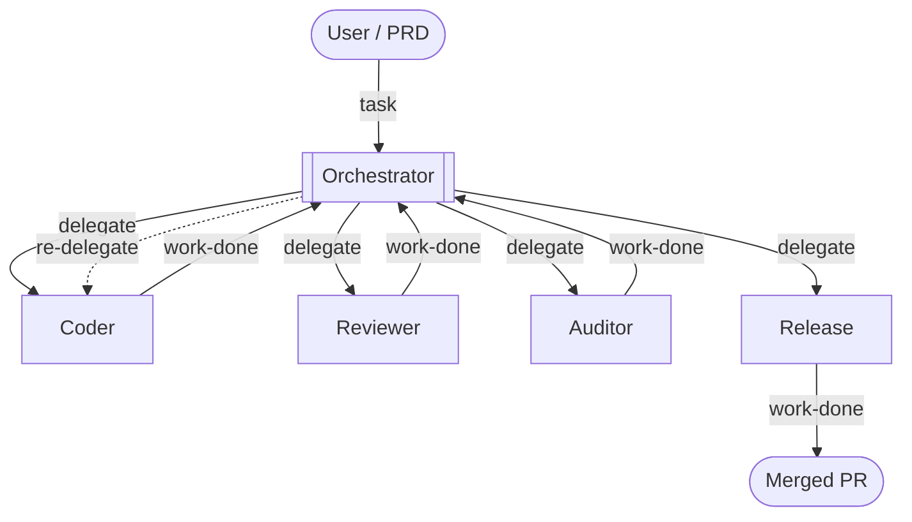

# Orchestration and dispatcher mode: rationale moved out of the user docs

> **Developer / maintainer reference.** Not published. PRD #1419 rewrote `docs/orchestration.md`, `docs/idle-workers-and-notifications.md` and `docs/dispatcher-mode.md` for the user's agent as reader (Decision 3: design rationale, mechanisms and project history come out of the user pages). The material below was on those pages and was not already recorded elsewhere under `docs/develop/`; it is kept here rather than deleted. Mechanism-level detail for the same features lives in [`delegate-delivery.md`](delegate-delivery.md), [`delegate-readiness.md`](delegate-readiness.md), [`draft-deferral.md`](draft-deferral.md), [`worker-reports.md`](worker-reports.md) and [`dispatcher-mode.md`](dispatcher-mode.md).

## Why orchestrations work (from `docs/orchestration.md`, "Why orchestrations work")

An agent reviewing its own code is like a developer reviewing their own PR: the same assumptions and the same blind spots. Running the reviewer as a separate agent, in a fresh session and on a different model if you like, gives an independent second opinion.

Each role also gets a single focused brief instead of juggling several concerns, and starts from only the context the orchestrator hands it, instead of a long conversation full of unrelated error traces and tool output.

The cost is time: a chain of agents is slower than a single run. Since the user is not watching it, that rarely matters.

The page also carried this diagram of one common pipeline shape (Mermaid, which the raw-Markdown site does not render):

## Why the command-entry lock exists (from "Typing into a worker is locked by default")

The orchestrator never learns about an instruction the user gives a worker directly, so the two can end up working against each other. The lock protects against typing the next instruction into whichever worker pane happened to be focused. Nothing is read-only: unlocking is two keys.

## Why a Codex worker is never re-typed (from "A lost task is re-sent into the same worker")

The deck cannot always tell whether Codex took a task, so typing a second copy could start the same work twice. A role whose agent the deck cannot identify gets no re-send for the same reason: the deck cannot hear such a worker start, so every re-send could be a duplicate.

## The readiness-buffer override (from "What `clear` does to delivery")

The user page used to ask users whose machines need more than a second of `DOT_AGENT_DECK_DELEGATE_READINESS_BUFFER_MS` to open an issue, to help tune the default. That request is a project ask rather than user guidance; if the default needs revisiting, those reports are the evidence to look for.

## Pane ids in worker reports (from `docs/idle-workers-and-notifications.md`)

The exited, never-came-up, respawn-failed and blocked reports name the worker by pane id rather than by role. The pane id can include the orchestration's name from the project configuration, in a sanitised form; issue #1380 tracks that.

## Dispatcher mode: why it exists and why it asks (from `docs/dispatcher-mode.md`)

Without dispatcher mode, starting parallel work means doing it by hand: create a git worktree, open a pane in it, launch an agent, paste the task, and repeat per line of work. Dispatcher mode is that chore, asked for in a sentence.

The shape of a unit (one agent or a team) is the user's call, not the agent's, so the dispatcher asks rather than guessing, once per unit. The mixed batch is where a single question goes wrong: a ten-line fix and an audit of every call site are not the same shape of work, and answering for the first should not quietly decide the rest. Naming an orchestration the project does not define is an error, not a silent fallback to something the user did not choose.

The `UNTRUSTED-…` markers around a unit's name and report are addressed to the dispatcher, not to the user: the report was written by another agent working in a repository the dispatcher has tool access to, so the deck hands it over as data. The user page used to reassure the reader that "nobody is shouting at you".

A unit's worktree with uncommitted changes is kept on close because a leftover directory costs disk space while a deleted one costs work.
