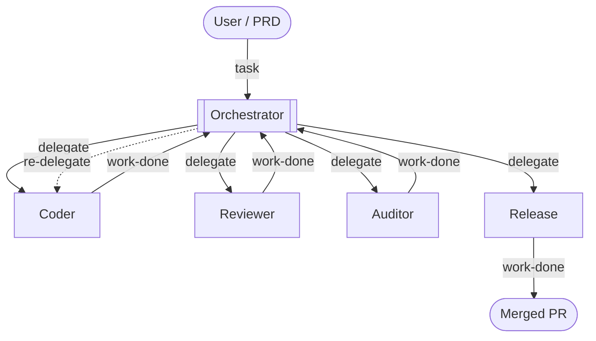

# Orchestration

Orchestrations are multi-agent pipelines where a designated **orchestrator** agent coordinates work across one or more **worker** agents. Each worker runs in its own pane, gets tasks injected into it, and signals completion back to the orchestrator — all automatically, through the daemon.

> **Prefer video?** This page is a written companion to the walkthrough below — a full development pipeline (coder → reviewer + auditor → release) running end-to-end on a real project.

<a href="https://youtu.be/ZIWWDDu02Ik"></a>

## Why orchestrations work

An agent reviewing its own code is like a developer reviewing their own PR: the same assumptions, the same blind spots, the same conviction that what they wrote is correct. Running the reviewer as a separate agent — in a fresh session, pointed at a different model if you like — removes that bias.

Specialization compounds the effect. An agent forced to juggle several concerns at once does each one less well than an agent with a single focused brief. Giving each role its own agent — and, where you can, its own model family — keeps every pass sharp: a fresh, specialized context with no unrelated baggage, and independent judgment that does not inherit another agent's blind spots.

Orchestrations also address context decay. As an agent accumulates a long conversation, implementation details, error traces, and tool output pile up and dilute focus. Worker agents receive only the context the orchestrator explicitly hands them, keeping each one sharp on its task.

The tradeoff is wall-clock time: chaining agents is slower than a single run. But since you are not sitting there watching, the duration rarely matters. You hand off a task, do something else, and come back when the pipeline is done.

## How it works

A pipeline has exactly one orchestrator and one or more workers. The orchestrator's job is coordination: delegating tasks, receiving summaries, and deciding what to do next. It does not write code, run tests, or modify files — those stay with workers.

The workers you define depend entirely on your project. A software development pipeline might have a coder, reviewer, auditor, and release agent. A research pipeline might have a planner, researcher, and writer. The diagram below shows one common shape:



Delegation signals travel through the daemon: no messages are lost if you detach the TUI and reattach later. Work-done feedback lands in the orchestrator's scrollback, survives any number of detach/reattach cycles, and is visible the moment you open the orchestration tab.

## Quick setup


The fastest way to get an orchestration config is to let an agent generate it from your project.

1. Launch `dot-agent-deck` and open a pane on your project directory.
2. Press `Ctrl+d` to enter command mode, then press `g` on the agent's dashboard card.
3. Choose **Yes** in the prompt. The deck sends a structured prompt asking the agent to analyze your project, pick roles from the [built-in role library](#role-library), wire up the commands it finds (devbox scripts, Makefile targets, bare `claude`/`opencode`/`pi`, etc.), and propose the config.
4. Review the proposal. The agent will list each role and explain why it chose it.
5. Tell the agent what to drop or change — or confirm as-is — and it writes `.dot-agent-deck.toml` to your project root.

<div style={{clear: 'both'}}></div>

The generated file includes both `[[modes]]` and `[[orchestrations]]`. You can remove either section if you only need one.

To write the config by hand, use the [configuration reference](#configuration-reference) below as a guide. `dot-agent-deck init` generates a modes-only starter template — it does not include an orchestration block.

## Configuration reference

### `[[orchestrations]]`

| Field | Type | Required | Default | Description |
|---|---|---|---|---|
| `name` | string | no | cwd basename | Display name shown in the tab bar. Defaults to the project directory name when empty. |
| `roles` | array | yes | — | Role definitions. Must contain at least one role with `start = true`. |

### `[[orchestrations.roles]]`

| Field | Type | Required | Default | Description |
|---|---|---|---|---|
| `name` | string | yes | — | Role identifier. Shown on the role card in the deck so you can tell agents apart at a glance. Also used in `--to` arguments and in task/work-done file names. Must be unique within the orchestration. Must not contain `/`, `\`, or `..`. |
| `command` | string | yes | — | Shell command that launches the agent for this role. Must result in a `claude`, `opencode`, or `pi` process (e.g. `claude`, `devbox run agent-big`, `opencode --model gpt-4o`, `pi --provider openrouter`). Other commands will run but won't get live status tracking on the role card. |
| `start` | bool | no | `false` | `true` marks this role as the orchestrator. Exactly one role per orchestration must have `start = true`. |
| `description` | string | no | — | Tells the orchestrator when to use this role and what it is for, so it can decide which worker to delegate to in a given situation. Also shown on the role card in the deck. |
| `prompt_template` | string | no | — | Standing instructions the orchestrator prepends to every task it sends this role. When set, the orchestrator's `--task` content is appended under a `## Task` heading — the worker sees both the template and the task together. |
| `clear` | bool | no | `true` | Intended to restart the agent session between delegations for context isolation. Set to `false` for roles that need to carry state across delegations (e.g. a `release` role that must remember the PR URL and branch name when retrying after a CI failure). |

> **Note:** The `clear = true` daemon-side session restart is not yet implemented. Delegated tasks are currently injected into the existing session regardless of this setting. Use `clear = false` explicitly on roles that need persistent context (such as `release`) so the intent is clear in your config and the behavior will be correct once the restart lands.

### Minimal example

```toml
[[orchestrations]]
name = "code-review"

[[orchestrations.roles]]
name = "orchestrator"
command = "claude"
start = true
prompt_template = """
You coordinate the team. You NEVER write or review code yourself — only delegate.

Workflow:
- Delegate implementation to coder.
- After coder reports done, delegate to reviewer and auditor in parallel.
- If either flags blocking issues, re-delegate to coder with the specific feedback.
- Once the work is clean, delegate to release.

Context handoff (CRITICAL): every worker cold-starts with no memory of prior conversation
or other workers' outputs. Whatever you write in --task is the entire context the worker has.
Always include file paths, the relevant spec path, and any prior worker's findings when chaining.
"""

[[orchestrations.roles]]
name = "coder"
command = "claude --model sonnet"
description = "Implements features, fixes bugs, refactors code"
prompt_template = "Implement the requested change. Run the project's test command before reporting completion."

[[orchestrations.roles]]
name = "reviewer"
command = "claude"
description = "Reviews code changes for correctness, style, and edge cases"
prompt_template = "Review the change. Report findings only — do not modify code."

[[orchestrations.roles]]
name = "auditor"
command = "claude"
description = "Audits code for security vulnerabilities and unsafe patterns"
prompt_template = "Audit the change for security vulnerabilities. Report findings only — do not modify code."

[[orchestrations.roles]]
name = "release"
command = "claude --model haiku"
clear = false
description = "Runs the project's release flow; never modifies source code"
prompt_template = "Run the release flow (open PR, wait for CI, merge). Do NOT modify source code. If any step fails, report the exact error and stop."
```

## Starting an orchestration tab

Opening an orchestration tab uses the same `Ctrl+n` flow as a regular pane, but the **Mode** field selects an orchestration instead of a workspace mode.

1. Press `Ctrl+n` to open the new-pane form.
2. Use `Enter` to step into directories and `Space` to select the project directory that contains your `.dot-agent-deck.toml` with an `[[orchestrations]]` block.
3. In the unified form, use `Left`/`Right` (or `h`/`l`) to cycle the **Mode** field past any workspace modes until the orchestration name appears.
4. Press `Enter`. The command field is not used for orchestration tabs — each role pane is launched with its own `command` from the config.

A new tab opens with one pane per role. The role cards appear on the left sidebar; the orchestrator's pane is active on the right. Each pane has the role's `command` running inside it.


### Navigating the orchestration tab

These require command mode — press `Ctrl+d` first if you are typing in a role pane:

| Key | Action |
|---|---|
| `Left` / `Right` (or `h` / `l`) | Cycle to previous / next tab |
| `1`–`9` | Jump to role card N and focus its pane |

These work from anywhere, including while typing in a role pane:

| Key | Action |
|---|---|
| `Ctrl+PageDown` / `Ctrl+PageUp` | Cycle to next / previous tab |
| `Ctrl+w` | Close the orchestration tab (stops all role panes) |

The sidebar shows each role's status live (thinking, working, waiting, idle, error) so you can see at a glance who is busy without switching panes.

## How delegation works

The orchestrator delegates a task to one or more workers. The deck delivers the task to each worker's pane automatically, including the worker's `prompt_template` as standing context. Each worker works independently, then signals completion. The deck notifies the orchestrator, which reads the summary and decides what to do next.


### Parallel delegation

The orchestrator can delegate to multiple workers simultaneously — for example, sending a code change to both a reviewer and an auditor at the same time. Both workers start immediately and report back independently when done.


## Context handoff

Workers cold-start with no memory of prior conversation, no access to other workers' outputs, and no shared scratchpad. Whatever the orchestrator includes in a delegation is the **entire context the worker has** — plus the worker's `prompt_template`. The orchestrator's `prompt_template` is where you tell it how to delegate well: which files to reference, how to summarise prior findings when chaining workers, and what to include when retrying after a failure.

### Use a tracking file

The most effective pattern is to give the orchestrator a spec or task file — a PRD, a checklist, whatever suits your workflow — and tell it to read the file and keep it updated as work progresses. You can do this in the orchestrator's `prompt_template`, in your opening message to it, or both.

This pays off in two ways. First, the file becomes the single source of truth that workers can be pointed at directly, keeping delegations concise. Second, if the orchestrator's context gets compacted or the session is restarted, it can read the file and resume exactly where it left off without losing track of what has been done, what is in progress, and what comes next.

## Role library

Roles are fully defined by you — name, command, description, and prompt. There are no restrictions on what roles an orchestration can have.

When generating a config, the deck's agent picks from these built-in suggestions as a starting point. Treat the generated config as exactly that: a starting point. As you use the orchestration, you will find that certain prompt templates are too vague, certain roles are missing, or certain workflows need adjusting. Edit `.dot-agent-deck.toml` freely — changes take effect on the next delegation without restarting any panes.

| Role | Description | `clear` default |
|---|---|---|
| `coder` | Implements features, fixes bugs, refactors code | `true` |
| `reviewer` | Reviews code changes for correctness, style, and edge cases | `true` |
| `auditor` | Audits code for security vulnerabilities and unsafe patterns | `true` |
| `tester` | Writes and runs tests; useful for TDD-style flows | `true` |
| `documenter` | Writes and updates documentation only — never modifies source code | `true` |
| `release` | Runs the project's release/PR/merge workflow; never modifies code | `false` |
| `researcher` | Investigates the codebase or external sources to gather context | `true` |

### Why `release` has `clear = false`

The release flow is stateful: open branch → push → create PR → wait for CI → merge. If the agent is restarted between the PR creation and the CI wait, it loses the PR URL and branch name. `clear = false` lets the release agent carry state across delegations and retries, so it can pick up where it left off after a CI failure.

## Example orchestrations

### Code review

Five-role pipeline: orchestrator → coder → reviewer + auditor (in parallel) → release.

```toml
[[orchestrations]]
name = "dev-flow"

[[orchestrations.roles]]
name = "orchestrator"
command = "claude --model opus"
start = true
prompt_template = """
You coordinate the team. You NEVER implement, review, or audit work yourself.

Workflow:
1. Delegate implementation to coder. Include the relevant spec path under prds/.
2. After coder is done, delegate to reviewer and auditor in parallel. Include the files coder changed.
3. If either reviewer or auditor flags a blocking issue, re-delegate to coder with the exact finding.
4. Repeat until reviewer and auditor are satisfied.
5. Before delegating to release, summarize what to validate end-to-end and STOP until the user confirms.
6. Delegate the release flow to release.

Context handoff (CRITICAL): workers cold-start with no memory of prior conversation or other
workers' outputs. Include all context in --task: file paths, spec paths, error messages, findings.
If context is long, write it to .dot-agent-deck/<slug>.md and reference the path in --task.
"""

[[orchestrations.roles]]
name = "coder"
command = "claude --model sonnet"
description = "Implements features, fixes bugs, refactors code"
prompt_template = """
Implement the requested change. Read the spec file first if one is referenced.
Run the project's test suite before reporting completion.
Commit your changes before calling dot-agent-deck work-done.
If critical context is missing from the task, surface it in your work-done summary — the orchestrator will re-delegate with the missing context.
"""

[[orchestrations.roles]]
name = "reviewer"
command = "claude"
description = "Reviews code changes for correctness, style, and edge cases"
prompt_template = """
Review the change. Report findings only — do not modify code.
Focus on correctness, consistency with the codebase, edge cases, and missed requirements.
If a spec is referenced, verify the implementation matches it.
If critical context is missing, surface it in your work-done summary.
"""

[[orchestrations.roles]]
name = "auditor"
command = "opencode --model gpt-4o"
description = "Audits code for security vulnerabilities and unsafe patterns"
prompt_template = """
Audit the change for security vulnerabilities and OWASP top-10 class issues. Report findings only — do not modify code.
If the task references a file or diff, read it before starting.
If critical context is missing, surface it in your work-done summary.
"""

[[orchestrations.roles]]
name = "release"
command = "claude --model haiku"
clear = false
description = "Runs the project's release flow; never modifies source code"
prompt_template = """
Run the release flow: create branch, push, open PR, wait for CI, merge.
Do NOT modify source code. If any step fails, report the exact error and stop.
The orchestrator will re-delegate source fixes to coder.
"""
```

### TDD cycle

Three-role pipeline: orchestrator → tester (writes failing tests) → coder (makes them pass) → tester (validates) → repeat.

```toml
[[orchestrations]]
name = "tdd"

[[orchestrations.roles]]
name = "orchestrator"
command = "claude --model opus"
start = true
prompt_template = """
You run a TDD cycle. You NEVER write code or tests yourself.

Workflow:
1. Delegate to tester to write failing tests for the feature described in --task.
2. Delegate to coder to implement until all tests pass.
3. Delegate back to tester to verify tests are green and coverage is adequate.
4. If tester finds gaps, re-delegate to coder with the specific failing tests.
5. Repeat until tester is satisfied.

Context handoff: workers cold-start with no memory. Include test file paths and feature spec
in every delegation. When chaining tester → coder, list which tests are failing.
"""

[[orchestrations.roles]]
name = "tester"
command = "claude"
description = "Writes and runs tests; useful for TDD-style flows"
prompt_template = """
Write tests first, then run them to confirm they fail before any implementation.
Follow the project's test layout and naming conventions.
Report which tests you wrote and which are currently failing/passing.
If critical context is missing, surface it in your work-done summary.
"""

[[orchestrations.roles]]
name = "coder"
command = "claude --model sonnet"
description = "Implements features, fixes bugs, refactors code"
prompt_template = """
Implement the minimum code to make the listed failing tests pass.
Do not modify the test files. Run the test suite before reporting completion.
If critical context is missing, surface it in your work-done summary.
"""
```

## Validate your config

Run `dot-agent-deck validate` to check your `.dot-agent-deck.toml` for issues before opening an orchestration tab:

```bash
cd your-project
dot-agent-deck validate
```

## Troubleshooting

### Worker says `DOT_AGENT_DECK_PANE_ID is not set`

The `dot-agent-deck delegate` and `work-done` commands read `DOT_AGENT_DECK_PANE_ID` to identify the calling pane. This variable is set automatically in every role pane when the orchestration tab opens. If it is missing, the command was run outside an orchestration pane (e.g. from your own terminal, not from inside an agent's pane).

### "delegate from non-orchestrator pane"

Only the role with `start = true` can call `dot-agent-deck delegate`. If a worker tries to delegate, the daemon rejects it and logs this message. Check that your config has exactly one role with `start = true`.

### Worker receives no task

The role name in `--to` must match the `name` field in the config exactly (case-sensitive). Check for typos. Also verify the worker's pane is part of the same orchestration tab — you cannot delegate across tabs.

### Orchestrator receives no work-done feedback

The daemon writes feedback to the orchestrator pane via the PTY. If the orchestrator's pane is closed, the feedback write fails silently. The `.dot-agent-deck/work-done-<role>.md` file is still written and can be read manually.

### Prompt template is not being applied

The daemon re-reads `.dot-agent-deck.toml` on every delegation, so edits take effect immediately without restarting the pane. Verify the role's `name` in the config matches the `--to` argument exactly, and that the config file is at the project root.

### Two orchestrations with the same project name conflict

If you run two orchestration tabs from different directories that happen to have the same basename (e.g. `~/a/myproject` and `~/b/myproject`), the daemon disambiguates delegation routing by their full path.

## See also

- [Workspace Modes](workspace-modes.md) — the simpler tab type that pairs an agent with live side panes
- [Configuration](configuration.md) — global and project-level configuration options
- [Keyboard Shortcuts](keyboard-shortcuts.md) — all keybindings, including tab navigation
