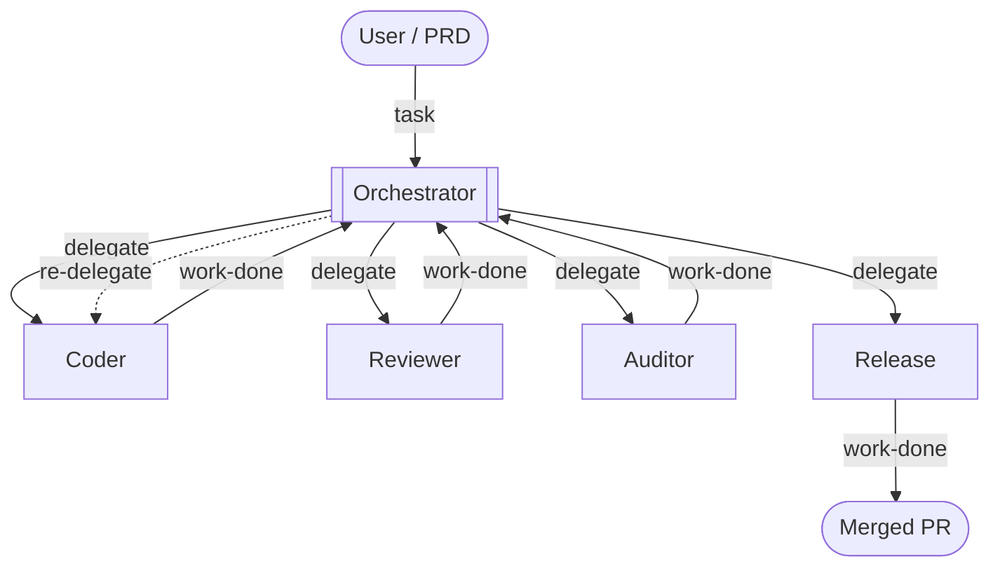

# Orchestration

Orchestrations are multi-agent pipelines where a designated **orchestrator** agent coordinates work across one or more **worker** agents. Each worker runs in its own pane, gets tasks injected into it, and signals completion back to the orchestrator — all automatically, through the daemon.

> **Prefer video?** This page is a written companion to the walkthrough below — a full development pipeline (coder → reviewer + auditor → release) running end-to-end on a real project.

<a href="https://youtu.be/ZIWWDDu02Ik"></a>

## Why orchestrations work

An agent reviewing its own code is like a developer reviewing their own PR: the same assumptions, the same blind spots, the same conviction that what they wrote is correct. Running the reviewer as a separate agent — in a fresh session, pointed at a different model if you like — removes that bias.

Specialization compounds the effect. An agent forced to juggle several concerns at once does each one less well than an agent with a single focused brief. Giving each role its own agent — and, where you can, its own model family — keeps every pass sharp: a fresh, specialized context with no unrelated baggage, and independent judgment that does not inherit another agent's blind spots.

Orchestrations also address context decay. As an agent accumulates a long conversation, implementation details, error traces, and tool output pile up and dilute focus. Worker agents receive only the context the orchestrator explicitly hands them, keeping each one sharp on its task.

The tradeoff is wall-clock time: chaining agents is slower than a single run. But since you are not sitting there watching, the duration rarely matters. You hand off a task, do something else, and come back when the pipeline is done.

## How it works

A pipeline has exactly one orchestrator and one or more workers. The orchestrator's job is coordination: delegating tasks, receiving summaries, and deciding what to do next. It does not write code, run tests, or modify files — those stay with workers.

The workers you define depend entirely on your project. A software development pipeline might have a coder, reviewer, auditor, and release agent. A research pipeline might have a planner, researcher, and writer. The diagram below shows one common shape:


```mermaid
flowchart TD
    User(["User / PRD"])
    Orch[["Orchestrator"]]
    Coder["Coder"]
    Reviewer["Reviewer"]
    Auditor["Auditor"]
    Release["Release"]
    PR(["Merged PR"])

    User -->|task| Orch
    Orch -->|delegate| Coder
    Coder -->|work-done| Orch
    Orch -->|delegate| Reviewer
    Orch -->|delegate| Auditor
    Reviewer -->|work-done| Orch
    Auditor -->|work-done| Orch
    Orch -.->|re-delegate| Coder
    Orch -->|delegate| Release
    Release -->|work-done| PR
```

Delegation signals travel through the daemon: no messages are lost if you detach the TUI and reattach later. Work-done feedback lands in the orchestrator's scrollback, survives any number of detach/reattach cycles, and is visible the moment you open the orchestration tab.

## Quick setup


The fastest way to get an orchestration config is to let an agent generate it from your project.

1. Launch `dot-agent-deck` and open a pane on your project directory.
2. Press `Ctrl+d` to enter command mode, then press `g` on the agent's dashboard card.
3. Choose **Yes** in the prompt. The deck sends a structured prompt asking the agent to analyze your project, pick roles from the [built-in role library](#role-library), wire up the commands it finds (devbox scripts, Makefile targets, bare `claude`/`opencode`/`pi`/`codex`/`devin`, etc.), and propose the config.
4. Review the proposal. The agent will list each role and explain why it chose it.
5. Tell the agent what to drop or change — or confirm as-is — and it writes `.dot-agent-deck.toml` to your project root.

<div style={{clear: 'both'}}></div>

The generated file includes both `[[modes]]` and `[[orchestrations]]`. You can remove either section if you only need one.

To write the config by hand, use the [configuration reference](#configuration-reference) later on this page as a guide. `dot-agent-deck init` generates a modes-only starter template — it does not include an orchestration block.

## Starting an orchestration tab

Opening an orchestration tab uses the same `Ctrl+n` flow as a regular pane, but the **Mode** field selects an orchestration instead of a workspace mode.

1. Press `Ctrl+n` to open the new-pane form.
2. Use `Enter` to step into directories and `Space` to select the project directory that contains your `.dot-agent-deck.toml` with an `[[orchestrations]]` block.
3. In the unified form, use `Left`/`Right` (or `h`/`l`) to cycle the **Mode** field past any workspace modes until the orchestration name appears.
4. Press `Enter`. The command field is not used for orchestration tabs — each role pane is launched with its own [`command`](#configuration-reference) from the config.

A new tab opens with one pane per role. The role cards appear on the left sidebar; the orchestrator's pane is active on the right. Each pane has the role's `command` running inside it.


An orchestration can also be started **in an isolated copy of the repository** rather than in your working tree, by asking a dispatcher pane for it — useful for running several orchestrations in parallel without them treading on each other. See [Dispatcher Mode](dispatcher-mode.md).

### Navigating the orchestration tab

These require command mode — press `Ctrl+d` first if you are typing in a role pane:

| Key | Action |
|---|---|
| `Left` / `Right` (or `h` / `l`) | Cycle to previous / next tab |
| `1`–`9` | Jump to role card N and focus its pane |
| `Ctrl+w` | Close the orchestration tab (stops all role panes), after a confirmation |
| `Ctrl+e` | **Experimental, off by default** — toggle the command-entry lock, i.e. whether you can type directly into a worker pane (see below) |
| `Ctrl+l` | Narrow the sidebar from the default 34/66 split to 25/75, giving the pane column more width (one setting for every orchestration tab) |
| `Ctrl+Z` | Zoom the focused role pane to the whole frame — the sidebar and the other panes are not drawn (see [Zooming the focused pane](#zooming-the-focused-pane)) |

These work from anywhere, including while typing in a role pane:

| Key | Action |
|---|---|
| `Ctrl+PageDown` / `Ctrl+PageUp` | Cycle to next / previous tab |

The sidebar shows each role's status live (thinking, working, waiting, idle, error) so you can see at a glance who is busy without switching panes.

The tab bar carries the same signal one level up: a **background** orchestration tab's label is colored by the single most urgent status among its panes, in priority order Error (red) > Needs Input (magenta) > Working (green) > Thinking (blue), so you can tell which of several open orchestration tabs needs attention without switching to any of them. Color means "something in here needs you": a tab whose roles are all idle stays in the ordinary tab color, and so does the tab you are currently on — it keeps the usual highlight the active tab always has, since you are already looking at it.

In the default `Stacked` pane layout, only the focused role's pane is drawn — switching roles swaps which pane is visible, but every other role's agent keeps running underneath, and the sidebar is what tells you it's still busy or idle. Toggle to `Tiled` (`Ctrl+t`) to see every role's pane at once.

### Zooming the focused pane

The 34/66 split is right while you are supervising — the sidebar is how you see which of seven agents is working. It is wrong once you have stopped supervising and started working *in* one agent: reading a long diff, following a plan, going back and forth with the orchestrator on a laptop screen. Press `Ctrl+Z` in command mode and the focused agent's pane takes the whole frame; press it again and the previous view returns exactly as it was. See [`Ctrl+Z` zooms the focused agent pane](keyboard-shortcuts.md#ctrlz-zooms-the-focused-agent-pane) for what it hides, what it keeps, and how it behaves on other tabs.

**Every agent keeps running while you are zoomed.** Zoom changes what is drawn and nothing else: no pane is stopped, delegation still routes, work-done and status hooks still arrive, and an idle worker is still detected. The `[Z]` marker on the border is there precisely because the failure mode is human — concluding your other agents have disappeared, or watching one agent while another sits blocked behind the hidden sidebar. Zoomed, you are genuinely less informed about everyone else; that is the trade the feature exists to let you make deliberately, which is why it is a working posture rather than a supervising one.

### Typing into a worker is locked by default (experimental)

> **Experimental — this section describes a surface that is off unless you turn it on.** Set `experimental = true` under a `[features]` table in your `.dot-agent-deck.toml`, or launch with `DOT_AGENT_DECK_EXPERIMENTAL=1`. With the flag off — the default — typing into a worker pane works exactly as it always has and the deck never moves focus on its own.

You talk to the orchestrator; the orchestrator talks to the workers. With the flag on, an orchestration tab makes that the default rather than a convention you have to remember: keystrokes aimed at a worker role are dropped instead of delivered until you deliberately unlock with `Ctrl+d`, `Ctrl+e`. See [`Ctrl+E` locks command entry to the orchestrator pane](keyboard-shortcuts.md#ctrle-locks-command-entry-to-the-orchestrator-pane) for the chord, its scope, and the exemption for a worker that is waiting on you.

The reason is that an orchestration is one workflow with a single coordinator. Type into a worker and you become a second, uncoordinated actor inside it: you change state the orchestrator believes it owns, and there is no path for it to learn that you did. What you usually get is not an obviously broken deck but a quietly diverged one — commonly the orchestrator and a worker contradicting each other into a deadlock. And most of the time it is not even deliberate: you open a worker pane to see how it is doing, get distracted, and type your next instruction into the pane that happens to be in front of you rather than the one you meant.

**Nothing is read-only, and nothing is taken away.** When you do want to reach into a worker — a provider hiccup parked an agent, a weaker model never called `work-done`, an agent is waiting somewhere you did not expect — it costs one deliberate `Ctrl+d`, `Ctrl+e`. That pause is the whole feature: it converts a reflex into a decision, which is why the default has to be locked for it to mean anything.

#### Focus follows the lock

While the deck is **locked**, it steers focus for you within the active orchestration tab: onto a role pane the moment it starts waiting on you — the lowest-numbered one first if several are waiting at once, advancing as each is dealt with — and back to the orchestrator once nothing is waiting any more. Focus never leaves the active tab to chase a waiting pane elsewhere; the tab label's colour already flags that.

While the deck is **unlocked**, no automatic focus move happens at all. Focus stays exactly where you put it — through a worker starting to wait, and through it finishing — until you lock again.

## How delegation works

The orchestrator delegates a task to one or more workers. The deck delivers the task to each worker's pane automatically, including the worker's [`prompt_template`](#configuration-reference) as standing context. Each worker works independently, then signals completion. The deck notifies the orchestrator, which reads the summary and decides what to do next.


A worker that never signals completion would otherwise stall the pipeline silently, since the orchestrator is parked waiting for it and gets no turn in which to notice. The daemon covers that case on a timeout — see [Idle Workers & Notifications](idle-workers-and-notifications.md), which also shows how to turn the moments a run stops and waits for you into messages that reach you away from the terminal.

### What `clear` does to delivery

[`clear`](#configuration-reference) decides whether the worker that receives a task is the same process that handled the last one, and that has consequences for how the task is delivered.

With `clear = false` the agent is left running. The task is typed straight into the session that is already sitting there, so delivery is immediate and the worker keeps everything it learned from previous delegations.

With `clear = true` — the default — every delegation is a cold start. The deck terminates the worker's agent (SIGTERM, escalating to SIGKILL if it does not go), launches the role's `command` again in the same pane, and delivers the task to the replacement. The role card stays where it is and keeps its name; the process underneath is new and the previous conversation is gone. That is the point: workers get a clean context per task instead of accumulating one long, drifting session.

There does not have to be a worker there to begin with. If the role's pane is empty — you closed it, or its agent died — the delegation creates a fresh one from the role's `command` instead of failing, so a role stays reachable for as long as the orchestration is running. If the replacement cannot be started at all, the deck says so in your orchestrator's pane rather than dropping the task silently; see [A delegated worker never came up](#a-delegated-worker-never-came-up).

The delivery cost of that restart is timing. A freshly launched agent announces that its session has started well **before** its input box is ready to accept a line of text and treat Enter as "submit", so a task written the instant that signal arrives can land in a pane that is not listening yet. Where the write falls on the agent's startup decides what you see: the task text sitting in the worker's input box unsubmitted until a human presses Enter, or nothing at all — no text, no activity, a worker that looks healthy and idle while the orchestrator waits for a `work-done` that will never come.

The deck therefore holds a `clear = true` task for a short **readiness buffer** after the replacement signals its session start (and after the fallback wait expires, for agents that never signal at all). The default is 1000 ms: the spawn-time path's 500 ms, which was tuned for a warm pane, doubled because a respawn is a cold start. Nothing about this is configured per role; the only effect you should notice is that a `clear = true` delegation takes about a second longer to appear in the worker's pane than a `clear = false` one. How long the deck actually holds a task depends on what it has been able to establish about the worker it is delivering to:

| what the deck can tell about the worker | how long it holds the task |
|---|---|
| it announced that its session is up | 1 second |
| the deck watched it take over its terminal | 5 seconds |
| it announces nothing before its first task | 8 seconds |

Which row a worker falls into depends on how its agent integrates with the deck, not on anything you configure.

Be clear about what that buys you: a fixed delay makes the race much less likely, but it cannot *prove* that the replacement is listening. The regression test behind it measures a deterministic test fixture — deliberately built to ignore input for 650 ms — and confirms the task is lost with the buffer at `0` and delivered and submitted at `1000`, which pins the mechanism. It does not measure how long any real agent version takes to boot on your machine.

So if tasks still go missing on your machine — a heavily loaded host, or an agent that boots more slowly than the buffer allows for — raise the buffer with the `DOT_AGENT_DECK_DELEGATE_READINESS_BUFFER_MS` environment variable, in milliseconds, on the process that starts the deck:

```bash
DOT_AGENT_DECK_DELEGATE_READINESS_BUFFER_MS=2000 dot-agent-deck
```

Values above `30000` are capped, and `0` disables the wait entirely (the pre-fix behaviour — useful only for reproducing the problem). It covers a scheduled task's first prompt as well as a delegation, and **the value you set replaces every row of the table above** rather than being added to it — so raising it slows every case down equally, and setting it below one of the longer waits shortens that case to your value. That is deliberate: you know something about your machine that watching one worker start does not refute. Please report it as well — a machine that needs more than a second is exactly the evidence needed to size this per agent.

#### If you are on an older release: `clear = false` is the workaround

Before this buffer existed, `clear = true` delegations could be lost outright, and users hit it consistently enough that two of them independently found the same workaround: set `clear = false` on the affected roles. It works because it removes the respawn, and with it the race — the agent is already running and already listening, so there is no startup window to write into. It was confirmed across different agents and different agent versions.

The trade-off is exactly the one the flag exists to express: those workers now carry context between delegations. That is fine for a stateful role like `release` and usually unwanted for a `coder` who should not remember the last three tasks. On a release that includes the readiness buffer you should not need the workaround at all — set `clear` on each role for the context behaviour you want, not to dodge a delivery bug.

### Parallel delegation

The orchestrator can delegate to multiple workers simultaneously — for example, sending a code change to both a reviewer and an auditor at the same time. Both workers start immediately and report back independently when done.


## Context handoff

Workers cold-start with no memory of prior conversation, no access to other workers' outputs, and no shared scratchpad. Whatever the orchestrator includes in a delegation is the **entire context the worker has** — plus the worker's `prompt_template`. The orchestrator's `prompt_template` is where you tell it how to delegate well: which files to reference, how to summarise prior findings when chaining workers, and what to include when retrying after a failure.

Task text passed inline goes through the orchestrator's own shell before dot-agent-deck ever sees it, so parts of it can be executed or quietly dropped while the delegation still reports success. The generated protocol therefore defaults to handing the task over as a file, which is read off disk verbatim — nothing for you to configure.

That default assumes the agent is *authorized* to write a file, which is not the same as having a file-writing tool: a role launched with a restricted tool allowlist — `claude --allowedTools Bash Read`, say — hits an interactive approval prompt instead, and an unattended pane parks there forever. The protocol has a fallback for that case, but it cannot grant itself the tool. That part is yours: if a role is expected to take the primary path, add the file-writing tool to its `command`'s allowlist (e.g. `--allowedTools Bash Read Write`) so it never meets the prompt.

### Use a tracking file

The most effective pattern is to give the orchestrator a spec or task file — a PRD, a checklist, whatever suits your workflow — and tell it to read the file and keep it updated as work progresses. You can do this in the orchestrator's `prompt_template`, in your opening message to it, or both.

This pays off in two ways. First, the file becomes the single source of truth that workers can be pointed at directly, keeping delegations concise. Second, if the orchestrator's context gets compacted or the session is restarted, it can read the file and resume exactly where it left off without losing track of what has been done, what is in progress, and what comes next.

## Role library

Roles are fully defined by you — name, command, description, and prompt. There are no restrictions on what roles an orchestration can have.

When generating a config, the deck's agent picks from these built-in suggestions as a starting point. Treat the generated config as exactly that: a starting point. As you use the orchestration, you will find that certain prompt templates are too vague, certain roles are missing, or certain workflows need adjusting. Edit `.dot-agent-deck.toml` freely — changes take effect on the next delegation without restarting any panes.

| Role | Description | `clear` default |
|---|---|---|
| `coder` | Implements features, fixes bugs, refactors code | `true` |
| `reviewer` | Reviews code changes for correctness, style, and edge cases | `true` |
| `auditor` | Audits code for security vulnerabilities and unsafe patterns | `true` |
| `tester` | Writes and runs tests; useful for TDD-style flows | `true` |
| `documenter` | Writes and updates documentation only — never modifies source code | `true` |
| `release` | Runs the project's release/PR/merge workflow; never modifies code | `false` |
| `researcher` | Investigates the codebase or external sources to gather context | `true` |

### Why `release` has `clear = false`

The release flow is stateful: open branch → push → create PR → wait for CI → merge. If the agent is restarted between the PR creation and the CI wait, it loses the PR URL and branch name. `clear = false` lets the release agent carry state across delegations and retries, so it can pick up where it left off after a CI failure.

## Configuration reference

### `[[orchestrations]]`

| Field | Type | Required | Default | Description |
|---|---|---|---|---|
| `name` | string | no | cwd basename | Display name shown in the tab bar. Defaults to the project directory name when empty. |
| `default` | bool | no | `false` | Marks this as the orchestration to open when nothing named one — in practice a [scheduled task](scheduled-tasks.md) rooted here, since the new-pane form and a dispatcher agent both ask. Exactly one orchestration may declare it, and it must have roles; with a single orchestration it does nothing. Without any declaration the first orchestration with roles wins, which is what happened before this key existed. See [Which orchestration a scheduled task opens](#which-orchestration-a-scheduled-task-opens). |
| `extends` | string | no | — | Inherit another orchestration's roles by its `name`, then override them with this block's own `[[orchestrations.roles]]` entries, matched by role name. Written for the case where several orchestrations run the same team on different providers. See [Sharing a workflow with `extends`](#sharing-a-workflow-with-extends). |
| `roles` | array | yes¹ | — | Role definitions. Must contain at least one role with `start = true`. ¹Optional in a block that `extends` another, which may restate only the roles it changes. |

### `[[orchestrations.roles]]`

| Field | Type | Required | Default | Description |
|---|---|---|---|---|
| `name` | string | yes | — | Role identifier. Shown on the role card in the deck so you can tell agents apart at a glance. Also used in `--to` arguments and in task/work-done file names. Must be unique within the orchestration. Must not contain `/`, `\`, or `..`. |
| `command` | string | yes | — | Shell command that launches the agent for this role. Must result in a `claude`, `opencode`, `pi`, `codex`, or `devin` process (e.g. `claude`, `devbox run agent-big`, `opencode --model gpt-4o`, `pi --provider openrouter`, `codex`, `devin`). Other commands will run but won't get live status tracking on the role card. |
| `agent` | string | no | — | Which agent `command` actually launches, when the command cannot say so itself — one of `claude`, `opencode`, `pi`, `codex`, `devin`. Set it whenever `command` runs the agent through something else (`devbox run -- codex`, `mise exec -- codex`, `make codex`, `./run-codex.sh`). See [Declaring the agent behind a launcher command](#declaring-the-agent-behind-a-launcher-command). |
| `start` | bool | no | `false` | `true` marks this role as the orchestrator. Exactly one role per orchestration must have `start = true`. |
| `description` | string | no | — | Tells the orchestrator when to use this role and what it is for, so it can decide which worker to delegate to in a given situation. Also shown on the role card in the deck. |
| `prompt_template` | string | no | — | Standing instructions the orchestrator prepends to every task it sends this role. When set, the orchestrator's task text — however it was passed, `--task` or `--task-file` — is appended under a `## Task` heading, so the worker sees both the template and the task together. |
| `clear` | bool | no | `true` | Restart the agent before each delegation, so every task starts from a clean context. The deck terminates the running agent, launches the role's `command` again in the same pane, waits through a readiness buffer, and only then delivers the task. Set to `false` for roles that need to carry state across delegations (e.g. a `release` role that must remember the PR URL and branch name when retrying after a CI failure). See [What `clear` does to delivery](#what-clear-does-to-delivery). |

### Declaring the agent behind a launcher command

The deck works out which agent a role runs by looking at the first word of its `command`. `claude --model opus`, `/usr/local/bin/codex`, `env FOO=1 codex` and `sh -c 'codex …'` all resolve fine. What cannot resolve is a command whose first word is a **launcher**: `devbox run -- codex`, `mise exec -- codex`, `nix develop -c codex`, `make codex`, or a project script like `./run-codex.sh`. The deck sees `devbox`, or `make`, or `run-codex.sh` — and there is no way to tell from the outside what any of those will end up starting, so it does not guess.

Two things follow from that, and one of them is easy to miss. The obvious one: the role card reads **No agent** and shows no status. The subtler one: identifying the agent is also what lets the deck monitor it, and for **Codex** that monitoring is the only thing that can identify the pane before you give it work — Codex does not announce itself until its first turn begins. So a Codex role behind a launcher stays blank from launch until the moment you delegate the first task to it, and then quietly starts working. Claude, by comparison, announces itself as soon as it starts, which is why the same `devbox run` wrapper looks fine for a Claude role and broken for a Codex one.

`agent` is how you answer the question the command cannot:

```toml
[[orchestrations.roles]]
name = "reviewer"
command = "devbox run -- codex --sandbox workspace-write"
agent = "codex"
```

Notes on how it behaves:

- The value is the agent's command name — `claude`, `opencode`, `pi`, `codex` or `devin` — matched exactly and in lower case. It is the same name `dot-agent-deck wrap --agent <name>` takes, and both resolve it the same way.
- **An unrecognised name gives you no agent rather than a guess.** `agent = "codx"` does not fall back to reading the command; it means "this pane has no agent", the same as if detection had failed. That is deliberate — silently overruling what you wrote would be worse — but it does mean a typo looks like the problem you were trying to fix. `dot-agent-deck validate` warns about an unknown name and lists the ones it accepts.
- The declaration **wins over the command**. If you declare `agent = "codex"` on a role whose command runs Claude, you get Codex, so keep the two in step.
- It is re-read from `.dot-agent-deck.toml` on every delegation, exactly like `command` is. Edit either one and the next `clear = true` delegation picks it up — you do not have to recreate the role's pane.
- Leaving `agent` out, or leaving it empty, changes nothing: the deck reads the command as it always has. Existing configs need no edit.

For a mode's agent pane the same key lives on `[[modes]]` — see [Workspace Modes](workspace-modes.md#declaring-the-agent-behind-a-launcher-command).

### Minimal example

The deck writes the delegation protocol — how to pass a task safely — into the orchestrator's context automatically at launch, so no `prompt_template` below needs to restate it.

```toml
[[orchestrations]]
name = "code-review"

[[orchestrations.roles]]
name = "orchestrator"
command = "claude"
start = true
prompt_template = """
You coordinate the team. You NEVER write or review code yourself — only delegate.

Workflow:
- Delegate implementation to coder.
- After coder reports done, delegate to reviewer and auditor in parallel.
- If either flags blocking issues, re-delegate to coder with the specific feedback.
- Once the work is clean, delegate to release.

Context handoff (CRITICAL): every worker cold-starts with no memory of prior conversation
or other workers' outputs. The task text you send is the entire context the worker has.
Always include file paths, the relevant spec path, and any prior worker's findings when chaining.
"""

[[orchestrations.roles]]
name = "coder"
command = "claude --model sonnet"
description = "Implements features, fixes bugs, refactors code"
prompt_template = "Implement the requested change. Run the project's test command before reporting completion."

[[orchestrations.roles]]
name = "reviewer"
command = "claude"
description = "Reviews code changes for correctness, style, and edge cases"
prompt_template = "Review the change. Report findings only — do not modify code."

[[orchestrations.roles]]
name = "auditor"
command = "claude"
description = "Audits code for security vulnerabilities and unsafe patterns"
prompt_template = "Audit the change for security vulnerabilities. Report findings only — do not modify code."

[[orchestrations.roles]]
name = "release"
command = "claude --model haiku"
clear = false
description = "Runs the project's release flow; never modifies source code"
prompt_template = "Run the release flow (open PR, wait for CI, merge). Do NOT modify source code. If any step fails, report the exact error and stop."
```

## Example orchestrations

### Code review

Five-role pipeline: orchestrator → coder → reviewer + auditor (in parallel) → release.

```toml
[[orchestrations]]
name = "dev-flow"

[[orchestrations.roles]]
name = "orchestrator"
command = "claude --model opus"
start = true
prompt_template = """
You coordinate the team. You NEVER implement, review, or audit work yourself.

Workflow:
1. Delegate implementation to coder. Include the relevant spec path under prds/.
2. After coder is done, delegate to reviewer and auditor in parallel. Include the files coder changed.
3. If either reviewer or auditor flags a blocking issue, re-delegate to coder with the exact finding.
4. Repeat until reviewer and auditor are satisfied.
5. Before delegating to release, summarize what to validate end-to-end and STOP until the user confirms.
6. Delegate the release flow to release.

Context handoff (CRITICAL): workers cold-start with no memory of prior conversation or other
workers' outputs. Include all context in the task: file paths, spec paths, error messages, findings.
If context is long, write it to .dot-agent-deck/<slug>.md and pass that file rather than pasting it.
"""

[[orchestrations.roles]]
name = "coder"
command = "claude --model sonnet"
description = "Implements features, fixes bugs, refactors code"
prompt_template = """
Implement the requested change. Read the spec file first if one is referenced.
Run the project's test suite before reporting completion.
Commit your changes before calling dot-agent-deck work-done.
If critical context is missing from the task, surface it in your work-done summary — the orchestrator will re-delegate with the missing context.
"""

[[orchestrations.roles]]
name = "reviewer"
command = "claude"
description = "Reviews code changes for correctness, style, and edge cases"
prompt_template = """
Review the change. Report findings only — do not modify code.
Focus on correctness, consistency with the codebase, edge cases, and missed requirements.
If a spec is referenced, verify the implementation matches it.
If critical context is missing, surface it in your work-done summary.
"""

[[orchestrations.roles]]
name = "auditor"
command = "opencode --model gpt-4o"
description = "Audits code for security vulnerabilities and unsafe patterns"
prompt_template = """
Audit the change for security vulnerabilities and OWASP top-10 class issues. Report findings only — do not modify code.
If the task references a file or diff, read it before starting.
If critical context is missing, surface it in your work-done summary.
"""

[[orchestrations.roles]]
name = "release"
command = "claude --model haiku"
clear = false
description = "Runs the project's release flow; never modifies source code"
prompt_template = """
Run the release flow: create branch, push, open PR, wait for CI, merge.
Do NOT modify source code. If any step fails, report the exact error and stop.
The orchestrator will re-delegate source fixes to coder.
"""
```

### TDD cycle

Three-role pipeline: orchestrator → tester (writes failing tests) → coder (makes them pass) → tester (validates) → repeat.

```toml
[[orchestrations]]
name = "tdd"

[[orchestrations.roles]]
name = "orchestrator"
command = "claude --model opus"
start = true
prompt_template = """
You run a TDD cycle. You NEVER write code or tests yourself.

Workflow:
1. Delegate to tester to write failing tests for the feature described in the incoming task.
2. Delegate to coder to implement until all tests pass.
3. Delegate back to tester to verify tests are green and coverage is adequate.
4. If tester finds gaps, re-delegate to coder with the specific failing tests.
5. Repeat until tester is satisfied.

Context handoff: workers cold-start with no memory. Include test file paths and feature spec
in every delegation. When chaining tester → coder, list which tests are failing.
"""

[[orchestrations.roles]]
name = "tester"
command = "claude"
description = "Writes and runs tests; useful for TDD-style flows"
prompt_template = """
Write tests first, then run them to confirm they fail before any implementation.
Follow the project's test layout and naming conventions.
Report which tests you wrote and which are currently failing/passing.
If critical context is missing, surface it in your work-done summary.
"""

[[orchestrations.roles]]
name = "coder"
command = "claude --model sonnet"
description = "Implements features, fixes bugs, refactors code"
prompt_template = """
Implement the minimum code to make the listed failing tests pass.
Do not modify the test files. Run the test suite before reporting completion.
If critical context is missing, surface it in your work-done summary.
"""
```

## Validate your config

Run `dot-agent-deck validate` to check your `.dot-agent-deck.toml` for issues before opening an orchestration tab:

```bash
cd your-project
dot-agent-deck validate
```

It reports errors (which stop an orchestration opening) and warnings (which do not). Among them, for projects with more than one orchestration: declaring `default = true` twice, or on a block with no roles, is an **error**; defining several orchestrations and declaring the default on none of them is a **warning**, because the choice then rests on the order of the blocks in the file.

## More than one orchestration

A project can define more than one `[[orchestrations]]` block, and the usual reason is that different kinds of work want different workflows — a feature that needs a test-plan gate and a release step is not the same pipeline as a one-line bug fix. A second reason is the same team wired to a different set of agent CLIs, so a contributor who has credentials for only one provider can still run it and work survives one provider's credits running out.

Two keys make that practical, and the first two sections below cover them. **Defining** several orchestrations is a separate question from **running** several at the same time, which the sections after them are about.

### Sharing a workflow with `extends`

Two orchestrations that share a workflow — the same roles, the same prompts, the same order — should not be two copies of it. `extends` lets one inherit another's roles, so the second is only what actually differs. The clearest case is a set of provider variants, where that is just each role's `command`:

```toml
[[orchestrations]]
name = "mixed"
default = true

[[orchestrations.roles]]
name = "orchestrator"
command = "devbox run agent-orchestrator"
start = true
prompt_template = """
You coordinate the team. …
"""

[[orchestrations.roles]]
name = "coder"
command = "devbox run agent-coder"
description = "Implements features, fixes bugs"

[[orchestrations]]
name = "GPT"
extends = "mixed"

[[orchestrations.roles]]
name = "orchestrator"
command = "devbox run agent-orchestrator-oc"

[[orchestrations.roles]]
name = "coder"
command = "devbox run agent-coder-oc"
```

`GPT` gets both roles with `mixed`'s `start`, `description` and `prompt_template` intact; only the two commands differ. Editing the orchestrator's `prompt_template` in `mixed` changes it for every variant — which is the point, and the reason to prefer this over copying the block.

The rules:

- **`extends` names the parent's literal `name`.** The parent may appear anywhere in the file, above or below. A block with no `name` cannot be a parent.
- **Roles are matched by name and the parent's ORDER is kept.** A role's position within the orchestration is what the tab layout and delegation key panes on, so a variant always opens with the same columns as its parent, whatever order you write the overrides in.
- **An omitted field keeps the parent's value.** Restate only what differs. To turn off an inherited `clear = true`, write `clear = false` explicitly — an omitted boolean means "inherit", not "false".
- **A role name the parent does not have is added** as a new role, and must carry its own `command` since there is nothing to inherit one from.
- **Chains work** (`a` extends `b` extends `c`); a cycle is rejected when the file is read.
- **`default` and `name` are never inherited** — they identify the block, not its workflow.

An `extends` naming an orchestration that does not exist, or forming a cycle, fails the whole config to load with a message naming both sides. That is deliberate: the alternative leaves the variant with only the roles it restated, and the symptom is then "orchestration must have at least 2 roles" about a file that plainly has six.

### Which orchestration a scheduled task opens

**Most of the time nothing needs a default.** Both ways of starting an orchestration by hand ask you which one: the new-pane form (`Ctrl+n`) lists every orchestration as a Mode chip to cycle through, and a [dispatcher pane](dispatcher-mode.md) lists them and asks before it starts anything.

`default = true` is for the case where **there is nobody to ask** — a [scheduled task](scheduled-tasks.md) whose working directory defines orchestrations. It fires on a cron tick, and something has to decide which team it opens:

```toml
[[orchestrations]]
name = "prd"
default = true
# roles …

[[orchestrations]]
name = "issue"
# roles …
```

`default` sits on the block, so it moves with the block. Exactly one orchestration may declare it, and that orchestration must define roles — `dot-agent-deck validate` rejects both mistakes. **With a single orchestration the key does nothing; omit it.**

**If nothing declares it, the first orchestration with roles wins.** That is the historical rule and it still applies, so a config written before this key keeps behaving identically. With several orchestrations it is worth declaring anyway, because reordering the file then changes which team every scheduled run opens, and nothing in that diff says so.

When the choice is left implicit, the deck says so rather than quietly picking. `dot-agent-deck validate` is where **you** see it:

```
$ dot-agent-deck validate
[warning] 'prd': 2 orchestrations are defined and none declares `default = true`, so a dispatch or scheduled task that names none opens this one purely because it comes first in the file — reordering the file would silently change that. Add `default = true` to the one you want.
```

A **dispatcher agent** is told the same thing in its own words, and its listing marks the default so it can act on *"just use the usual one"* rather than asking twice:

```
Available dispatch targets:
  single            one agent (--single)
  orchestration     'prd' — 6 roles (--orchestration 'prd')  [default]
  orchestration     'issue' — 4 roles (--orchestration 'issue')

Ask the user which they want before dispatching, then pass the matching flag.
```

A **scheduled task** has nobody to tell, so its copy goes only to the daemon log. That is the whole reason to declare the default: it is the one path where the deck cannot ask you and cannot show you that it did not.

### Running several at the same time

Concurrent orchestrations are safe **across directories**. Each orchestration tab is its own routing group, so a delegate never reaches another orchestration's worker and a work-done never reaches another orchestration's orchestrator — even when two orchestrations share the same `name`. Distinct directories also mean distinct `.dot-agent-deck/` coordination files and distinct working trees, so the two pipelines never contend for the same state on disk either.

For parallel lines of work on the *same project*, give each orchestration its own **git worktree**. A worktree is a second checkout of the same repository at a different path, so each orchestration gets its own directory — its own routing group, its own coordination files, its own source tree — while sharing one git history and one set of branches. This is the model the deck's own [scheduled issue dispatch](scheduled-tasks.md) already uses: one worktree per dispatched issue.

Create one however you prefer. By hand it is a single command:

```bash
git worktree add ../myproject-feature-x -b feature-x
```

If your project vendors the `/worktree-prd` skill (from [dot-ai](https://github.com/vfarcic/dot-ai)), ask an agent in the deck to run it and it creates the worktree and branch for you. Then open a new orchestration tab with `Ctrl+n` and point the directory field at the worktree.

### Same-directory orchestrations are discouraged

Opening a second orchestration in a directory that already runs one is allowed, and routing stays correct — but two resources cannot be partitioned, no matter what the deck does:

- **The coordination files.** `.dot-agent-deck/worker-task-<role>.md` and `.dot-agent-deck/work-done-<role>.md` are keyed by role name within the directory. Two orchestrations that both have a `coder` role write the same two files, so the second brief overwrites the first before the first worker has necessarily read it.
- **The working tree.** Both sets of workers edit the same files, stage into the same git index, and build into the same target directory. This is the same hazard as two people working in one checkout, and no amount of file namespacing fixes it.

So when you select an orchestration whose directory already hosts a live one, the new-pane form shows a warning:

```
  ! This directory already runs an orchestration.
    Both share .dot-agent-deck/*-{role}.md files
    and one working tree; /worktree-prd isolates.
```

The warning is non-blocking: press `Enter` and the tab opens as usual. It exists to make the shared files and the shared tree explicit at the moment they start to matter, so proceeding is a deliberate choice rather than a surprise. If the two orchestrations genuinely need to run at once, a worktree per orchestration is the isolated alternative.

## Troubleshooting

### Worker says `DOT_AGENT_DECK_PANE_ID is not set`

The `dot-agent-deck delegate` and `work-done` commands read `DOT_AGENT_DECK_PANE_ID` to identify the calling pane. This variable is set automatically in every role pane when the orchestration tab opens. If it is missing, the command was run outside an orchestration pane (e.g. from your own terminal, not from inside an agent's pane).

### "delegate from non-orchestrator pane"

Only the role with `start = true` can call `dot-agent-deck delegate`. If a worker tries to delegate, the daemon rejects it and logs this message. Check that your config has exactly one role with `start = true`.

### Worker receives no task

The role name in `--to` must match the `name` field in the config exactly (case-sensitive). Check for typos. Also verify the worker's pane is part of the same orchestration tab — you cannot delegate across tabs.

### A role card reads "No agent", or a Codex role stays blank until the first task

The role's `command` launches the agent through something the deck cannot see past — `devbox run -- codex`, `mise exec -- codex`, `make codex`, `./run-codex.sh`. Add an [`agent`](#declaring-the-agent-behind-a-launcher-command) line to that role naming what it launches, and the card identifies itself at spawn instead. If you already have one and the card is still blank, check the spelling: an unrecognised name means "no agent" on purpose, and `dot-agent-deck validate` will name it.

### A delegated worker never came up

A `clear = true` delegation terminates the worker before it has a replacement, so if the replacement never starts, the pane is left with no agent and the task has nowhere to go. When that happens the deck writes `⚠ delegated worker never came up (dot-agent-deck daemon report)` into your orchestrator's pane and stops: nothing was delivered, and no `work-done` can arrive for that delegation. The notice names the worker's pane; the daemon log names the role and carries the underlying error.

The usual cause is the role's `command` — a launcher that fails in that directory, a binary that is not on the daemon's `PATH`, or an agent that exits immediately on start. Jump into the worker's pane and look at its scrollback: whatever the replacement printed before it died is still there. Running the role's `command` by hand in the worker's directory reproduces most of these in one step.

Before this notice existed the deck waited out its full 30-second readiness window, wrote into the empty pane, had the write refused, and dropped the task with only a line in the daemon log — so the orchestrator was told nothing was wrong and waited for a completion that could never arrive.

### Closing a worker's pane and then delegating to it

The role comes back. Closing a pane takes a few seconds to finish, and a `clear = true` delegation that arrives during it waits for the close to complete and then creates a fresh worker for the role — which is what `clear = true` means in the first place. The same recovery applies to a worker whose agent simply died: the next delegation to that role starts a new one rather than failing.

If you want a role to stay gone, remove it from `.dot-agent-deck.toml` (or close the whole orchestration tab); closing one worker's pane is not a way to take a role out of an orchestration that is still running.

### Orchestrator receives no work-done feedback

Feedback is written into the orchestrator's pane. If that pane is closed, there is nowhere to write it and the message is lost silently. The `.dot-agent-deck/work-done-<role>.md` file is written first, so for a delegated task it can still be read manually — unless the daemon could not write it, in which case the daemon log carries a `failed to write work-done summary` warning and any file at that path belongs to an **earlier** delegation (or is a partial write).

### Orchestrator is told a completion was "unsolicited"

The daemon records every delegation it dispatches, and a `work-done` that answers none of them is reported to the orchestrator with an explicit label saying so, followed by the worker's report inline. The commonest cause is a worker being tasked **directly by a person**: the `## When done` instruction survives in that worker's context from an earlier delegation, so it signals completion again for work the orchestrator never asked for. Without the label the orchestrator reads that as a delegated task coming back and re-plans on it.

Nothing is dropped — the report still arrives, framed as information rather than as delivered work — and `.dot-agent-deck/work-done-<role>.md` is deliberately left untouched, so an uncommissioned report cannot overwrite the last one the orchestrator did commission. If you want a completion to be reported as delegated work, delegate it: task the worker through the orchestrator rather than typing into its pane.

Two consequences of "untouched" are worth knowing before you go looking for a file. An **orchestrator** running `dot-agent-deck work-done` on itself without `--done` counts as uncommissioned too — nobody delegates to the orchestrator — so no `work-done-<orchestrator-role>.md` is written for it; use `--done` to close out the orchestration, or delegate the work to a role. And a delegate that never actually **reached** its worker — the identity gate refused the write, a `clear = true` respawn failed and left the notice `⚠ respawn failed for role '<role>'` in your orchestrator pane, or the replacement never came up and left `⚠ delegated worker never came up` there — commissions nothing, so a completion arriving from that worker afterwards is uncommissioned by the same rule. That is deliberate: the alternative is a stale commission that quietly relabels some later, unrelated completion as delegated work.

### The summary file could not be written

When the daemon cannot write `.dot-agent-deck/work-done-<role>.md` — no working directory recorded for the pane, the `.dot-agent-deck` directory cannot be created, or the write itself fails — it does **not** tell the orchestrator to read that path. It says the file is unavailable and inlines the worker's report into the feedback instead. That matters because the path is keyed by role name and reused for every delegation to that role: pointing at it after a failed write hands the orchestrator the previous delegation's report, which is well-formed, from the right role, and for the wrong task. An inlined report loses its Markdown formatting (the feedback is collapsed to a single line) and is truncated past 4000 characters; the worker still holds the full text.

### Prompt template is not being applied

The daemon re-reads `.dot-agent-deck.toml` on every delegation, so edits take effect immediately without restarting the pane. Verify the role's `name` in the config matches the `--to` argument exactly, and that the config file is at the project root.

### Two orchestrations with the same project name conflict

If you run two orchestration tabs from different directories that happen to have the same basename (e.g. `~/a/myproject` and `~/b/myproject`), the daemon disambiguates delegation routing by their full path. Two tabs of the *same* orchestration in the *same* directory are also routed separately — each tab is its own routing group — but they still share the coordination files and the working tree, which is why the deck warns about that case. See [Running several at the same time](#running-several-at-the-same-time).

## See also

- [Idle Workers & Notifications](idle-workers-and-notifications.md) — the timeout that reports a silent worker to the orchestrator, and an example recipe for notifying yourself
- [Workspace Modes](workspace-modes.md) — the simpler tab type that pairs an agent with live side panes
- [Configuration](configuration.md) — global and project-level configuration options
- [Keyboard Shortcuts](keyboard-shortcuts.md) — all keybindings, including tab navigation
