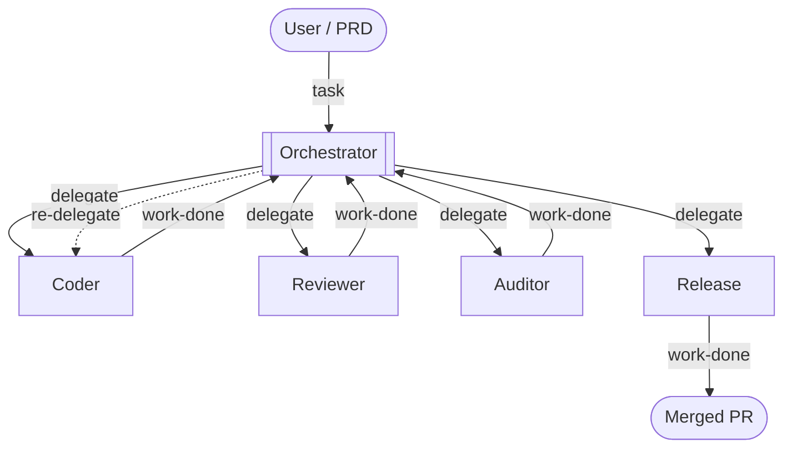

import Tabs from '@theme/Tabs';
import TabItem from '@theme/TabItem';

# Orchestration

Orchestrations are multi-agent pipelines where a designated **orchestrator** agent coordinates work across one or more **worker** agents. Each worker runs in its own pane, receives its tasks from the orchestrator, and reports back to it when it is done — you talk to the orchestrator, and it runs the team.

> **Prefer video?** This page is a written companion to the walkthrough below — a full development pipeline (coder → reviewer + auditor → release) running end-to-end on a real project.

<a href="https://youtu.be/ZIWWDDu02Ik"></a>

## Why orchestrations work

An agent reviewing its own code is like a developer reviewing their own PR: the same assumptions and the same blind spots. Running the reviewer as a separate agent — in a fresh session, on a different model if you like — gives you an independent second opinion.

Each role also gets a single focused brief instead of juggling several concerns, and starts from only the context the orchestrator hands it, instead of a long conversation full of unrelated error traces and tool output.

The cost is time: a chain of agents is slower than a single run. Since you are not watching it, that rarely matters — hand off the task, do something else, and come back when the pipeline is done.

## How it works

A pipeline has exactly one orchestrator and one or more workers. The orchestrator's job is coordination: delegating tasks, receiving summaries, and deciding what to do next. It does not write code, run tests, or modify files — those stay with workers.

The workers you define depend entirely on your project. A software development pipeline might have a coder, reviewer, auditor, and release agent. A research pipeline might have a planner, researcher, and writer. The diagram below shows one common shape:


```mermaid
flowchart TD
    User(["User / PRD"])
    Orch[["Orchestrator"]]
    Coder["Coder"]
    Reviewer["Reviewer"]
    Auditor["Auditor"]
    Release["Release"]
    PR(["Merged PR"])

    User -->|task| Orch
    Orch -->|delegate| Coder
    Coder -->|work-done| Orch
    Orch -->|delegate| Reviewer
    Orch -->|delegate| Auditor
    Reviewer -->|work-done| Orch
    Auditor -->|work-done| Orch
    Orch -.->|re-delegate| Coder
    Orch -->|delegate| Release
    Release -->|work-done| PR
```

You can detach from the deck and reattach whenever you like: the orchestration keeps running, and every worker's report is in the orchestrator's pane when you come back.

## Quick setup

The fastest way to get an orchestration config is to let an agent generate it from your project. Generating it is a TUI feature; the config it writes is used by both clients.


1. Launch `dot-agent-deck` and open a pane on your project directory.
2. Press `Ctrl+d` to enter command mode, then press `g` on the agent's dashboard card.
3. Choose **Yes** in the prompt. The deck sends a structured prompt asking the agent to analyze your project, pick roles from the [built-in role library](#role-library), wire up the commands it finds (devbox scripts, Makefile targets, bare `claude`/`opencode`/`pi`/`codex`/`devin`, etc.), and propose the config.
4. Review the proposal. The agent will list each role and explain why it chose it.
5. Tell the agent what to drop or change — or confirm as-is — and it writes `.dot-agent-deck.toml` to your project root.

The generated file includes both `[[modes]]` and `[[orchestrations]]`. You can remove either section if you only need one.

To write the config by hand, use the [configuration reference](#configuration-reference) later on this page as a guide. `dot-agent-deck init` generates a modes-only starter template — it does not include an orchestration block.

## Starting an orchestration tab

Both clients start an orchestration from their New agent flow, by choosing the orchestration as the **Mode**. The TUI opens it as an orchestration tab; the desktop app shows it as one group on its Dashboard.

<Tabs groupId="client">
<TabItem value="tui" label="TUI">

Opening an orchestration tab uses the same `Ctrl+n` flow as a regular pane, but the **Mode** field selects an orchestration instead of a workspace mode.

1. Press `Ctrl+n` to open the New Agent form.
2. Use `Enter` to step into directories and `Space` to select the project directory that contains your `.dot-agent-deck.toml` with an `[[orchestrations]]` block.
3. In the unified form, use `Left`/`Right` (or `h`/`l`) to cycle the **Mode** field past any workspace modes until the orchestration name appears.
4. Press `Enter`. The command field is not used for orchestration tabs — each role pane is launched with its own [`command`](#configuration-reference) from the config.

A new tab opens with one pane per role. The role cards appear on the left sidebar; the orchestrator's pane is active on the right. Each pane has the role's `command` running inside it.


</TabItem>
<TabItem value="desktop" label="Desktop">

1. Open **New agent** from the Dashboard (or press `Ctrl+N` / `⌘N`) and choose the daemon.
2. Browse to the project directory that contains your `.dot-agent-deck.toml` with an `[[orchestrations]]` block (it is tagged **project**) and press **Use this directory**.
3. Under **Mode**, pick the `Orch: <name>` chip for the orchestration. There is no **Command** field: each role is launched with its own [`command`](#configuration-reference) from the config.
4. Optionally type a **Name** for the run, then press **Activate orchestration**.

The Dashboard shows the run as an **ORCHESTRATION** group with a row per role, numbered in role order, and an **ORCHESTRATOR** badge on the start role, the one you message. Click a role's row to open its terminal. The group's **Close** stops every role, after a confirmation that lists them (**Close all N roles**). See [Desktop app → Dashboard](desktop/dashboard.md) and [New agent](desktop/new-agent.md).


</TabItem>
</Tabs>

An orchestration can also be started **in an isolated copy of the repository** rather than in your working tree, by asking a dispatcher pane for it — useful for running several orchestrations in parallel without them treading on each other. See [Dispatcher Mode](dispatcher-mode.md).

### Navigating the orchestration tab

*This section and the next two are about the TUI's orchestration tab.*

These require command mode — press `Ctrl+d` first if you are typing in a role pane:

| Key | Action |
|---|---|
| `Left` / `Right` (or `h` / `l`) | Cycle to previous / next tab |
| `1`–`9` | Jump to role card N and focus its pane |
| `Ctrl+w` | Close the orchestration tab (stops all role panes), after a confirmation |
| `Ctrl+e` | **Experimental, off by default** — toggle the command-entry lock, i.e. whether you can type directly into a worker pane (see below) |
| `Ctrl+l` | Narrow the sidebar from the default 34/66 split to 25/75, giving the pane column more width (one setting for every orchestration tab) |
| `Ctrl+Z` | Zoom the focused role pane to the whole frame — the sidebar and the other panes are not drawn (see [Zooming the focused pane](#zooming-the-focused-pane)) |

These work from anywhere, including while typing in a role pane:

| Key | Action |
|---|---|
| `Ctrl+PageDown` / `Ctrl+PageUp` | Cycle to next / previous tab |

The sidebar shows each role's status live (thinking, working, waiting, idle, error) so you can see at a glance who is busy without switching panes.

The tab bar does the same one level up: a **background** orchestration tab's label takes the color of its most urgent pane — Error (red), then Needs Input (magenta), then Working (green), then Thinking (blue) — so you can see which open orchestration needs you without switching to it. A tab whose roles are all idle keeps the ordinary tab color, and the tab you are on keeps the usual active-tab highlight.

In the default `Stacked` layout only the focused role's pane is shown; the other agents keep running, and the sidebar shows what they are doing. Press `Ctrl+t` for `Tiled` to see every role's pane at once.

### Zooming the focused pane

When you want to work *in* one agent rather than watch the team — reading a long diff, or going back and forth with the orchestrator on a laptop screen — press `Ctrl+Z` in command mode and the focused pane takes the whole frame. Press it again to get the previous view back exactly as it was. See [`Ctrl+Z` zooms the focused agent pane](keyboard-shortcuts.md#ctrlz-zooms-the-focused-agent-pane) for what it hides, what it keeps, and how it behaves on other tabs.

**Every agent keeps running while you are zoomed** — tasks, reports, statuses and [idle-worker reports](idle-workers-and-notifications.md) all carry on. What you lose is the sidebar, so while the border shows `[Z]` you will not see a worker that is waiting for you. Zoom in to work; zoom out to supervise.

### Typing into a worker is locked by default (experimental)

> **Experimental — this section describes a surface that is off unless you turn it on.** Set `experimental = true` under a `[features]` table in your `.dot-agent-deck.toml`, or launch with `DOT_AGENT_DECK_EXPERIMENTAL=1`. With the flag off — the default — typing into a worker pane works exactly as it always has and the deck never moves focus on its own.

You talk to the orchestrator; the orchestrator talks to the workers. With the flag on, keystrokes aimed at a worker pane are dropped until you unlock with `Ctrl+d`, `Ctrl+e`. See [`Ctrl+E` locks command entry to the orchestrator pane](keyboard-shortcuts.md#ctrle-locks-command-entry-to-the-orchestrator-pane) for the keys, where the lock applies, and why a worker that is waiting on you stays typeable.

This protects you from the easy mistake of typing your next instruction into the worker pane you happened to be looking at. The orchestrator never learns about an instruction you give a worker directly, and the two can end up working against each other.

**Nothing is read-only.** When you do need to reach into a worker — an agent stuck after a provider hiccup, a model that never sent `work-done`, a prompt you did not expect — press `Ctrl+d`, `Ctrl+e` and type.

#### Focus follows the lock

While the deck is **locked**, it steers focus for you within the active orchestration tab: onto a role pane the moment it starts waiting on you — the lowest-numbered one first if several are waiting at once, advancing as each is dealt with — and back to the orchestrator once nothing is waiting any more. Focus never leaves the active tab to chase a waiting pane elsewhere; the tab label's colour already flags that.

While the deck is **unlocked**, no automatic focus move happens at all. Focus stays exactly where you put it — through a worker starting to wait, and through it finishing — until you lock again.

## How delegation works

The orchestrator delegates a task to one or more workers. Each worker receives the task in its pane, together with its role's [`prompt_template`](#configuration-reference), works on it, and reports back with `work-done`. The orchestrator reads the report and decides what to do next.


If a worker gets stuck — it never reports back, or it sits at a permission prompt — the deck tells the orchestrator so it can act. See [Idle Workers & Notifications](idle-workers-and-notifications.md), which also shows how to have those moments sent to your phone.

### A deck prompt waits while you have an unsent draft

The deck sends messages into panes for you — a delegated task, a worker's report, a scheduled prompt, the reports in [Idle Workers & Notifications](idle-workers-and-notifications.md). If you have typed something into that pane and not sent it yet, the deck's message **waits** instead of being sent together with your text. Press **Enter** to send what you typed, or **Ctrl+U** or **Ctrl+C** to clear it, and the waiting message follows on its own. Other panes, and the rest of the orchestration, keep running meanwhile.

The wait lasts at most **60 seconds**, so a stray keystroke cannot stall an unattended run. After that the message is sent anyway — possibly together with your text — and the pane's status shows **Error**. To change the limit, set `DOT_AGENT_DECK_DRAFT_DEFER_CAP_MS` (milliseconds) on the command that starts the deck, or `0` to switch the wait off. A daemon that is already running keeps its old value until you restart it.

Only text you typed **through the deck** makes a message wait. Text the agent puts in its own input box — a prompt recalled from history, an autocompletion — does not, and messages the deck or the desktop app send at your request, such as a new orchestration's first prompt, never wait.

### One task per worker at a time

A worker that has been given a task stays busy with it until it sends `work-done`, and until then the deck will not give it another one. `dot-agent-deck delegate` then exits non-zero with `this delegate was NOT sent`, naming the worker, how many tasks it still owes, and how long ago the oldest was sent. When a delegate names several `--to` roles, the free ones still get the task: the command prints a warning naming the busy ones and exits 0 — re-send to just those roles, since repeating the whole delegate would give the free roles the task twice.

What counts is whether the worker has reported back, not what its card says: a card can show `Working` or idle while the worker still owes a `work-done`. A worker whose agent exited without reporting is still busy too; `dot-agent-deck pane restart <role>` frees it. If the orchestrator's own agent has been replaced since it delegated, the new orchestrator is not blocked by the old one's tasks — the delegate is sent, and the command says which earlier task it superseded.

When the earlier task is not coming back, there are three ways out:

- **`dot-agent-deck delegate --supersede …`** sends the task anyway, and the command says it superseded. The earlier task is not cancelled: on a `clear = false` worker the new task goes into the same session, and a late `work-done` for the earlier task still counts. On a `clear = true` worker the new task restarts the agent, so the earlier task is dropped.
- **`dot-agent-deck pane restart <role>`** replaces the worker's agent and drops the task it owed, along with that task's [idle-worker and went-quiet reports](idle-workers-and-notifications.md). A task that was still being handed to the worker when you restarted it is kept and goes to the replacement.
- **Waiting it out.** Seven days after a task was sent, the deck stops counting it, whether or not the worker answered.

### What `clear` does to delivery

[`clear`](#configuration-reference) decides whether the worker that receives a task is the same process that handled the last one, and that has consequences for how the task is delivered.

With `clear = false` the agent is left running. The task is typed straight into the session that is already sitting there, so delivery is immediate and the worker keeps everything it learned from previous delegations.

With `clear = true` — the default — every task starts fresh. The deck stops the worker's agent, starts the role's `command` again in the same pane, and hands the task to the new agent. The role card stays where it is with the same name, but the previous conversation is gone, so each task gets a clean context instead of one long, drifting session.

The role's pane does not even have to exist. If you closed it, or its agent died, the next task starts a fresh worker from the role's `command`, so a role stays reachable for as long as the orchestration runs. If the new worker cannot be started, the orchestrator is told in its pane; see [A delegated worker never came up](#a-delegated-worker-never-came-up).

A freshly started agent needs a moment before it accepts input, so a `clear = true` task arrives after a short wait: about one to eight seconds for a plain `claude`, `codex`, `opencode` or `pi` command, depending on the agent. For a role launched through a wrapper such as `devbox run …`, declare the [`agent`](#declaring-the-agent-behind-a-launcher-command), or a Codex, Pi or OpenCode worker waits up to 30 seconds on every task.

If tasks still go missing on your machine — the task text sits unsubmitted in the worker's input box, or the worker looks idle and never starts — raise the wait with the `DOT_AGENT_DECK_DELEGATE_READINESS_BUFFER_MS` environment variable, in milliseconds, on the process that starts the deck:

```bash
DOT_AGENT_DECK_DELEGATE_READINESS_BUFFER_MS=2000 dot-agent-deck
```

The value replaces the deck's own wait for every agent rather than adding to it, and also applies to a schedule's first prompt. Values above `30000` are capped. If your machine needs more than a second, please [open an issue](https://github.com/vfarcic/dot-agent-deck/issues) — it helps tune the default.

### Parallel delegation

The orchestrator can delegate to multiple workers simultaneously — for example, sending a code change to both a reviewer and an auditor at the same time. Both workers start immediately and report back independently when done.


## Context handoff

Workers start with no memory of earlier conversations, no access to other workers' output, and no shared scratchpad. What the orchestrator puts in a task is the **entire context the worker has** — plus the worker's `prompt_template`. Use the orchestrator's `prompt_template` to tell it how to delegate well: which files to reference, how to summarise earlier findings when chaining workers, and what to include when retrying after a failure.

The deck teaches the orchestrator and the workers how to hand tasks and reports over, and they do it by writing files. Two things to check in your role commands:

- **Let every role write files.** A role launched with a restricted tool allowlist — `claude --allowedTools Bash Read`, say — stops at an approval prompt each time it tries, and an unattended pane waits there indefinitely. Add the file-writing tool to its allowlist, e.g. `--allowedTools Bash Read Write`.
- **Write permission rules against the full path.** The commands the deck gives agents use the full path to the deck binary — `/home/you/.local/bin/dot-agent-deck work-done …`, not `dot-agent-deck work-done …`. A rule matching the command text, such as a Claude Code allow rule `Bash(dot-agent-deck work-done:*)`, does not match that, so write the rule against the path you see in the agent's pane.

### Use a tracking file

The most effective pattern is to give the orchestrator a spec or task file — a PRD, a checklist, whatever suits your workflow — and tell it to read the file and keep it updated as work progresses. You can do this in the orchestrator's `prompt_template`, in your opening message to it, or both.

This pays off in two ways. First, the file becomes the single source of truth that workers can be pointed at directly, keeping delegations concise. Second, if the orchestrator's context gets compacted or the session is restarted, it can read the file and resume exactly where it left off without losing track of what has been done, what is in progress, and what comes next.

## Role library

Roles are fully defined by you — name, command, description, and prompt. There are no restrictions on what roles an orchestration can have.

When generating a config, the deck's agent picks from these built-in suggestions as a starting point. Treat the generated config as exactly that: a starting point. As you use the orchestration, you will find that certain prompt templates are too vague, certain roles are missing, or certain workflows need adjusting. Edit `.dot-agent-deck.toml` freely — changes take effect on the next delegation without restarting any panes.

| Role | Description | `clear` default |
|---|---|---|
| `coder` | Implements features, fixes bugs, refactors code | `true` |
| `reviewer` | Reviews code changes for correctness, style, and edge cases | `true` |
| `auditor` | Audits code for security vulnerabilities and unsafe patterns | `true` |
| `tester` | Writes and runs tests; useful for TDD-style flows | `true` |
| `documenter` | Writes and updates documentation only — never modifies source code | `true` |
| `release` | Runs the project's release/PR/merge workflow; never modifies code | `false` |
| `researcher` | Investigates the codebase or external sources to gather context | `true` |

### Why `release` has `clear = false`

A release is a sequence: open a branch, push, create the PR, wait for CI, merge. A release agent restarted between creating the PR and waiting for CI would forget the PR URL and branch name. With `clear = false` it keeps them across tasks, so it can pick up where it left off after a CI failure.

## Configuration reference

### `[[orchestrations]]`

| Field | Type | Required | Default | Description |
|---|---|---|---|---|
| `name` | string | no | cwd basename | Display name shown in the tab bar. Defaults to the project directory name when empty. |
| `default` | bool | no | `false` | The orchestration opened when nothing names one — in practice a [schedule](scheduled-tasks.md) in this directory, since the New Agent form and a dispatcher agent ask you. At most one orchestration may set it, and it must have roles; with a single orchestration it does nothing. If none sets it, the first orchestration with roles is used. See [Which orchestration a schedule opens](#which-orchestration-a-schedule-opens). |
| `extends` | string | no | — | Inherit another orchestration's roles by its `name`, then override them with this block's own `[[orchestrations.roles]]` entries, matched by role name. Written for the case where several orchestrations run the same team on different providers. See [Sharing a workflow with `extends`](#sharing-a-workflow-with-extends). |
| `roles` | array | yes¹ | — | Role definitions. Must contain at least one role with `start = true`. ¹Optional in a block that `extends` another, which may restate only the roles it changes. |

### `[[orchestrations.roles]]`

| Field | Type | Required | Default | Description |
|---|---|---|---|---|
| `name` | string | yes | — | Role identifier. Shown on the role card in the deck so you can tell agents apart at a glance. Also used in `--to` arguments and in task/work-done file names. Must be unique within the orchestration. Must not contain `/`, `\`, or `..`. |
| `command` | string | yes | — | Shell command that launches the agent for this role. Must result in a `claude`, `opencode`, `pi`, `codex`, or `devin` process (e.g. `claude`, `devbox run agent-big`, `opencode --model gpt-4o`, `pi --provider openrouter`, `codex`, `devin`). Other commands will run but won't get live status tracking on the role card. |
| `agent` | string | no | — | Which agent `command` actually launches, when the command cannot say so itself — one of `claude`, `opencode`, `pi`, `codex`, `devin`. Set it whenever `command` runs the agent through something else (`devbox run -- codex`, `mise exec -- codex`, `make codex`, `./run-codex.sh`). See [Declaring the agent behind a launcher command](#declaring-the-agent-behind-a-launcher-command). |
| `start` | bool | no | `false` | `true` marks this role as the orchestrator. Exactly one role per orchestration must have `start = true`, and `dot-agent-deck validate` reports anything else as an error. If no role sets it, the role named `orchestrator` is the orchestrator, else the first role; if several do, the first of them is. |
| `description` | string | no | — | Tells the orchestrator when to use this role and what it is for, so it can decide which worker to delegate to in a given situation. Also shown on the role card in the deck. |
| `prompt_template` | string | no | — | Standing instructions sent with every task this role receives. The worker sees the template first and the orchestrator's task below it, under a `## Task` heading. |
| `clear` | bool | no | `true` | Restart the agent before each task, so every task starts from a clean context. Set to `false` for roles that need to remember things between tasks (e.g. a `release` role that must remember the PR URL and branch name when retrying after a CI failure). See [What `clear` does to delivery](#what-clear-does-to-delivery). |

### Declaring the agent behind a launcher command

The deck recognises the agent when `command` starts it directly: `claude --model opus`, `/usr/local/bin/codex`, `env FOO=1 codex` and `sh -c 'codex …'` all work. It cannot tell what a **launcher** will start — `devbox run -- codex`, `mise exec -- codex`, `nix develop -c codex`, `make codex`, or a project script like `./run-codex.sh`.

What you see when it cannot tell:

- The role card reads **No agent** and shows no status. A **Codex** role stays blank from launch until you delegate its first task to it, and then quietly starts working; a Claude role behind the same wrapper looks fine, because Claude identifies itself as soon as it starts.
- A Codex, Pi or OpenCode role with `clear = true` behind a launcher waits up to **30 seconds** for every task. `dot-agent-deck validate` warns about each such role.

Set `agent` to say which agent the launcher starts:

```toml
[[orchestrations.roles]]
name = "reviewer"
command = "devbox run -- codex --sandbox workspace-write"
agent = "codex"
```

Notes on how it behaves:

- The value is the agent's command name — `claude`, `opencode`, `pi`, `codex` or `devin` — in lower case, exactly as `dot-agent-deck wrap --agent <name>` takes it.
- **A misspelled name gives the role no agent at all.** `agent = "codx"` does not fall back to the command, so the card reads **No agent** — the very problem you were fixing. `dot-agent-deck validate` warns about an unknown name and lists the accepted ones.
- `agent` **wins over the command**. Declare `agent = "codex"` on a role whose command runs Claude and the deck treats it as Codex, so keep the two in step.
- A change to `agent` or `command` applies to the next `clear = true` task; you do not have to recreate the role's pane.
- Leaving `agent` out, or empty, changes nothing: the deck reads the command as usual.

For a mode's agent pane the same key lives on `[[modes]]` — see [Workspace Modes](workspace-modes.md#declaring-the-agent-behind-a-launcher-command).

### Minimal example

The deck teaches the orchestrator how to delegate and how workers report back, so a `prompt_template` only needs to describe your workflow.

```toml
[[orchestrations]]
name = "code-review"

[[orchestrations.roles]]
name = "orchestrator"
command = "claude"
start = true
prompt_template = """
You coordinate the team. You NEVER write or review code yourself — only delegate.

Workflow:
- Delegate implementation to coder.
- After coder reports done, delegate to reviewer and auditor in parallel.
- If either flags blocking issues, re-delegate to coder with the specific feedback.
- Once the work is clean, delegate to release.

Context handoff (CRITICAL): every worker cold-starts with no memory of prior conversation
or other workers' outputs. The task text you send is the entire context the worker has.
Always include file paths, the relevant spec path, and any prior worker's findings when chaining.
"""

[[orchestrations.roles]]
name = "coder"
command = "claude --model sonnet"
description = "Implements features, fixes bugs, refactors code"
prompt_template = "Implement the requested change. Run the project's test command before reporting completion."

[[orchestrations.roles]]
name = "reviewer"
command = "claude"
description = "Reviews code changes for correctness, style, and edge cases"
prompt_template = "Review the change. Report findings only — do not modify code."

[[orchestrations.roles]]
name = "auditor"
command = "claude"
description = "Audits code for security vulnerabilities and unsafe patterns"
prompt_template = "Audit the change for security vulnerabilities. Report findings only — do not modify code."

[[orchestrations.roles]]
name = "release"
command = "claude --model haiku"
clear = false
description = "Runs the project's release flow; never modifies source code"
prompt_template = "Run the release flow (open PR, wait for CI, merge). Do NOT modify source code. If any step fails, report the exact error and stop."
```

## Example orchestrations

### Code review

Five-role pipeline: orchestrator → coder → reviewer + auditor (in parallel) → release.

```toml
[[orchestrations]]
name = "dev-flow"

[[orchestrations.roles]]
name = "orchestrator"
command = "claude --model opus"
start = true
prompt_template = """
You coordinate the team. You NEVER implement, review, or audit work yourself.

Workflow:
1. Delegate implementation to coder. Include the relevant spec path under prds/.
2. After coder is done, delegate to reviewer and auditor in parallel. Include the files coder changed.
3. If either reviewer or auditor flags a blocking issue, re-delegate to coder with the exact finding.
4. Repeat until reviewer and auditor are satisfied.
5. Before delegating to release, summarize what to validate end-to-end and STOP until the user confirms.
6. Delegate the release flow to release.

Context handoff (CRITICAL): workers cold-start with no memory of prior conversation or other
workers' outputs. Include all context in the task: file paths, spec paths, error messages, findings.
If context is long, write it to .dot-agent-deck/<slug>.md and pass that file rather than pasting it.
"""

[[orchestrations.roles]]
name = "coder"
command = "claude --model sonnet"
description = "Implements features, fixes bugs, refactors code"
prompt_template = """
Implement the requested change. Read the spec file first if one is referenced.
Run the project's test suite before reporting completion.
Commit your changes before calling dot-agent-deck work-done.
If critical context is missing from the task, surface it in your work-done summary — the orchestrator will re-delegate with the missing context.
"""

[[orchestrations.roles]]
name = "reviewer"
command = "claude"
description = "Reviews code changes for correctness, style, and edge cases"
prompt_template = """
Review the change. Report findings only — do not modify code.
Focus on correctness, consistency with the codebase, edge cases, and missed requirements.
If a spec is referenced, verify the implementation matches it.
If critical context is missing, surface it in your work-done summary.
"""

[[orchestrations.roles]]
name = "auditor"
command = "opencode --model gpt-4o"
description = "Audits code for security vulnerabilities and unsafe patterns"
prompt_template = """
Audit the change for security vulnerabilities and OWASP top-10 class issues. Report findings only — do not modify code.
If the task references a file or diff, read it before starting.
If critical context is missing, surface it in your work-done summary.
"""

[[orchestrations.roles]]
name = "release"
command = "claude --model haiku"
clear = false
description = "Runs the project's release flow; never modifies source code"
prompt_template = """
Run the release flow: create branch, push, open PR, wait for CI, merge.
Do NOT modify source code. If any step fails, report the exact error and stop.
The orchestrator will re-delegate source fixes to coder.
"""
```

### TDD cycle

Three-role pipeline: orchestrator → tester (writes failing tests) → coder (makes them pass) → tester (validates) → repeat.

```toml
[[orchestrations]]
name = "tdd"

[[orchestrations.roles]]
name = "orchestrator"
command = "claude --model opus"
start = true
prompt_template = """
You run a TDD cycle. You NEVER write code or tests yourself.

Workflow:
1. Delegate to tester to write failing tests for the feature described in the incoming task.
2. Delegate to coder to implement until all tests pass.
3. Delegate back to tester to verify tests are green and coverage is adequate.
4. If tester finds gaps, re-delegate to coder with the specific failing tests.
5. Repeat until tester is satisfied.

Context handoff: workers cold-start with no memory. Include test file paths and feature spec
in every delegation. When chaining tester → coder, list which tests are failing.
"""

[[orchestrations.roles]]
name = "tester"
command = "claude"
description = "Writes and runs tests; useful for TDD-style flows"
prompt_template = """
Write tests first, then run them to confirm they fail before any implementation.
Follow the project's test layout and naming conventions.
Report which tests you wrote and which are currently failing/passing.
If critical context is missing, surface it in your work-done summary.
"""

[[orchestrations.roles]]
name = "coder"
command = "claude --model sonnet"
description = "Implements features, fixes bugs, refactors code"
prompt_template = """
Implement the minimum code to make the listed failing tests pass.
Do not modify the test files. Run the test suite before reporting completion.
If critical context is missing, surface it in your work-done summary.
"""
```

## Restarting and spawning worker panes

Two commands change a **running** orchestration without restarting the tab or the deck. Like [`dot-agent-deck delegate`](#how-delegation-works), only the orchestrator can run them, from its own pane; from any other pane they are refused.

- **`dot-agent-deck pane restart <role>`** restarts a worker in this orchestration. It is meant mainly for the orchestrator to recover by itself when a worker's agent crashes.
- **`dot-agent-deck pane spawn <role>`** starts a role that is in `.dot-agent-deck.toml` but not yet running in this orchestration — for example, one you added to the file after opening the tab. It is refused if the role is already running here, or is not in the file.

A `prompt_template` line can make the self-healing behavior explicit:

```
If a delegated worker role stops responding or its pane looks dead, run
`dot-agent-deck pane restart <role>` for that role yourself, then re-delegate
the task it was working on. Only ask the user if the restart itself fails.
```

The re-delegation works even though the earlier task never reported back: restarting a worker drops the task it owed, so the worker is no longer [busy](#one-task-per-worker-at-a-time).

The deck already teaches the orchestrator both commands, so a line like this only reinforces the behavior.

## Validate your config

Run `dot-agent-deck validate` to check your `.dot-agent-deck.toml` for issues before opening an orchestration tab:

```bash
cd your-project
dot-agent-deck validate
```

It reports errors (which stop an orchestration opening) and warnings (which do not). Among them, for projects with more than one orchestration: declaring `default = true` twice, or on a block with no roles, is an **error**; defining several orchestrations and declaring the default on none of them is a **warning**, because the choice then rests on the order of the blocks in the file.

## More than one orchestration

A project can define more than one `[[orchestrations]]` block — usually because different kinds of work want different workflows (a feature with a test plan and a release step is not a one-line bug fix), or to run the same team on a different set of agents, for someone with credentials for only one provider or for when one provider's credits run out.

The first two sections below cover the two keys that help with that; the rest are about **running** several orchestrations at the same time.

### Sharing a workflow with `extends`

`extends` lets one orchestration inherit another's roles, so you write only what differs instead of copying the whole block. The clearest case is a set of provider variants, where only each role's `command` changes:

```toml
[[orchestrations]]
name = "mixed"
default = true

[[orchestrations.roles]]
name = "orchestrator"
command = "devbox run agent-orchestrator"
start = true
prompt_template = """
You coordinate the team. …
"""

[[orchestrations.roles]]
name = "coder"
command = "devbox run agent-coder"
description = "Implements features, fixes bugs"

[[orchestrations]]
name = "GPT"
extends = "mixed"

[[orchestrations.roles]]
name = "orchestrator"
command = "devbox run agent-orchestrator-oc"

[[orchestrations.roles]]
name = "coder"
command = "devbox run agent-coder-oc"
```

`GPT` gets both roles with `mixed`'s `start`, `description` and `prompt_template`; only the two commands differ. Edit the orchestrator's `prompt_template` in `mixed` and every variant gets the change.

The rules:

- **`extends` names the parent's literal `name`.** The parent may appear anywhere in the file, above or below. A block with no `name` cannot be a parent.
- **Roles are matched by name and keep the parent's order**, so a variant opens with the same role cards as its parent, whatever order you write the overrides in.
- **An omitted field keeps the parent's value.** Restate only what differs. To turn off an inherited `clear = true`, write `clear = false` explicitly — an omitted boolean means "inherit", not "false".
- **A role name the parent does not have is added** as a new role, and must carry its own `command` since there is nothing to inherit one from.
- **Chains work** (`a` extends `b` extends `c`); a cycle is rejected when the file is read.
- **`default` and `name` are never inherited.**

An `extends` that names an orchestration that does not exist, or forms a cycle, stops the whole file from loading, with a message naming both orchestrations.

### Which orchestration a schedule opens

**Most of the time you do not need a default.** When you start an orchestration yourself you choose it: the New Agent form (`Ctrl+n`) lists every orchestration in its Mode field, and a [dispatcher pane](dispatcher-mode.md) asks before it starts anything.

`default = true` is for when **there is nobody to ask** — a [schedule](scheduled-tasks.md) whose working directory defines several orchestrations:

```toml
[[orchestrations]]
name = "prd"
default = true
# roles …

[[orchestrations]]
name = "issue"
# roles …
```

Only one orchestration may set it, and that orchestration must define roles — `dot-agent-deck validate` rejects both mistakes. **With a single orchestration the key does nothing; leave it out.**

**If nothing sets it, the first orchestration with roles is used.** With several orchestrations, set it anyway: otherwise reordering the blocks in the file quietly changes which team every scheduled run opens.

`dot-agent-deck validate` warns you when the choice is left to the order of the file:

```
$ dot-agent-deck validate
[warning] 'prd': 2 orchestrations are defined and none declares `default = true`, so a dispatch or schedule that names none opens this one purely because it comes first in the file — reordering the file would silently change that. Add `default = true` to the one you want.
```

A **dispatcher agent** sees the default marked in its list, so you can tell it *"just use the usual one"*:

```
Available dispatch targets:
  single            one agent (--single)
  orchestration     'prd' — 6 roles (--orchestration 'prd')  [default]
  orchestration     'issue' — 4 roles (--orchestration 'issue')

Ask the user which they want before dispatching, then pass the matching flag.
```

A **schedule** cannot ask or show you anything, so for a schedule this warning only reaches the [daemon log](troubleshooting.md#enabling-debug-logs) — which is why setting `default` matters most there.

### Running several at the same time

Orchestrations in **different directories** run side by side safely. Tasks and reports never cross from one orchestration tab to another, even when two orchestrations have the same `name`, and each directory has its own `.dot-agent-deck/` files and its own working tree.

For parallel work on the *same project*, give each orchestration its own **git worktree** — a second checkout of the same repository at a different path, sharing one git history and one set of branches. [Scheduled issue dispatch](scheduled-tasks.md) works the same way: one worktree per issue.

Create one however you prefer. By hand it is a single command:

```bash
git worktree add ../myproject-feature-x -b feature-x
```

If your project vendors the `/worktree-prd` skill (from [dot-ai](https://github.com/vfarcic/dot-ai)), ask an agent in the deck to run it and it creates the worktree and branch for you. Then open a new orchestration tab with `Ctrl+n` and point the directory field at the worktree.

### Same-directory orchestrations are discouraged

You can open a second orchestration in a directory that already runs one, and tasks still reach the right workers — but the two share two things:

- **The task and report files.** `.dot-agent-deck/worker-task-<role>.md` and `.dot-agent-deck/work-done-<role>.md` are named by role. Two orchestrations that both have a `coder` role use the same two files, so one's task can overwrite the other's before its worker has read it.
- **The working tree.** Both sets of workers edit the same files, stage into the same git index and build into the same target directory — like two people working in one checkout.

So when you pick an orchestration whose directory already runs one, the New Agent form warns you:

```
  ! This directory already runs an orchestration.
    Both share .dot-agent-deck/*-{role}.md files
    and one working tree; /worktree-prd isolates.
```

Press `Enter` and the tab opens anyway. If the two really need to run at once, give each its own worktree instead.

## Troubleshooting

### Worker says `DOT_AGENT_DECK_PANE_ID is not set`

`dot-agent-deck delegate` and `work-done` only work from inside a role pane of an orchestration tab, where the deck sets this variable for you. You see this error when one of them is run somewhere else — from your own terminal, for example.

### "delegate from non-orchestrator pane"

Only the orchestrator — the role with `start = true` — can run `dot-agent-deck delegate`; a worker that tries is refused with this message. Check that your config has exactly one role with `start = true`: without one, the orchestrator is the role named `orchestrator`, or else the first role, which may not be the one you meant.

### `pane restart` says "has not crashed; pass --force to restart a healthy pane"

Without `--force`, `dot-agent-deck pane restart <role>` only restarts a worker whose agent has exited — crashed, or simply finished — so it cannot kill a worker mid-task by accident. The orchestrator is not taught `--force`, but it sees this message and can use the flag. If you want force-restarts to stay your decision, say so in the orchestrator's `prompt_template`.

### `pane restart` never detects a wedged-but-alive agent

An agent that is still running but hung — stuck in a loop, or waiting on something that never comes — has not crashed, so `pane restart` refuses it with "has not crashed", exactly as it refuses a healthy one. If you think a worker is hung rather than slow, look at its pane, then use `--force` if it really is stuck.

### `pane spawn` refuses to create a second pane under an already-running role name

`dot-agent-deck pane spawn <role>` starts a pane for a role that has none; it does not start a second copy of a running role. To run two of the same kind of worker at once, give the second its own role name in `.dot-agent-deck.toml` (e.g. `reviewer2`).

### `delegate` says "this delegate was NOT sent: every worker it reached still owes a work-done"

The worker has not sent `work-done` for an earlier task, so it is still busy — see [One task per worker at a time](#one-task-per-worker-at-a-time) for the three ways out. If you believe the worker did report, look for its `work-done` in its pane: one that was refused (for example over a [capability token](troubleshooting.md#work-done-dispatch-or-delegate-fails-with-refused--hook-capability-token)) never reached the deck.

### Worker receives no task

The role name in `--to` must match the `name` field in the config exactly (case-sensitive). Also check that the worker is in the same orchestration tab — you cannot delegate across tabs.

### A role card reads "No agent", or a Codex role stays blank until the first task

The role's `command` launches the agent through something the deck cannot see past — `devbox run -- codex`, `mise exec -- codex`, `make codex`, `./run-codex.sh`. Add an [`agent`](#declaring-the-agent-behind-a-launcher-command) line to that role naming what it launches, and the card identifies itself at spawn instead. If you already have one and the card is still blank, check the spelling: an unrecognised name means "no agent" on purpose, and `dot-agent-deck validate` will name it.

### A delegated worker never came up

When a `clear = true` worker is restarted for a new task and the new agent never starts, your orchestrator's pane gets `⚠ delegated worker never came up (dot-agent-deck daemon report)`: the task was not delivered, and no `work-done` will come for it. An unattended orchestrator can then re-delegate, reassign the task, or notify you. The report names the worker's pane; the [daemon log](troubleshooting.md#enabling-debug-logs) names the role and the error.

The usual cause is the role's `command` — a launcher that fails in that directory, a binary that is not on the `PATH` the deck was started with, or an agent that exits as soon as it starts. Look at the worker's pane: whatever the agent printed before it died is still there. Running the role's `command` by hand in the worker's directory reproduces most of these.

### Closing a worker's pane and then delegating to it

The role comes back: the next `clear = true` task for it starts a fresh worker, even if it arrives while the pane is still closing. The same happens for a worker whose agent died.

If you want a role to stay gone, remove it from `.dot-agent-deck.toml` (or close the whole orchestration tab); closing one worker's pane is not a way to take a role out of an orchestration that is still running.

### Orchestrator receives no work-done feedback

Reports are sent into the orchestrator's pane; if that pane is closed, they are lost. For a delegated task the report is also saved to `.dot-agent-deck/work-done-<role>.md`, which you can read yourself — unless the [daemon log](troubleshooting.md#enabling-debug-logs) shows a `failed to write work-done summary` warning, in which case that file is from an **earlier** task (or incomplete).

### Orchestrator is told a completion was "unsolicited"

A `work-done` that answers no task the orchestrator delegated reaches the orchestrator labelled as unsolicited, with the worker's report included, so the orchestrator does not mistake it for a task coming back. The most common cause is **you giving a worker a task directly**: the worker still has the reporting instructions from an earlier task, so it reports again for work the orchestrator never asked for.

The report still arrives, but `.dot-agent-deck/work-done-<role>.md` is not updated — it keeps the last report for a task the orchestrator did delegate. To have a result count as delegated work, give the task through the orchestrator instead of typing into the worker's pane.

A report is also labelled unsolicited, and no file is written, when:

- the **orchestrator** runs `dot-agent-deck work-done` without `--done` — nobody delegates to the orchestrator; use `--done` to close out the orchestration, or delegate the work to a role;
- its task never reached the worker — for example, the orchestrator's pane showed `⚠ respawn failed for role '<role>'` or `⚠ delegated worker never came up`;
- its task was sent more than seven days ago;
- `dot-agent-deck pane restart <role>` dropped the task the worker owed.

### The summary file could not be written

When `.dot-agent-deck/work-done-<role>.md` cannot be written (for example, the `.dot-agent-deck` directory cannot be created), the orchestrator is told the file is unavailable and gets the worker's report in the message instead, as a single line without its Markdown formatting.

### Prompt template is not being applied

Edits to `.dot-agent-deck.toml` apply to the next task without restarting the pane. Check that the role's `name` matches the `--to` argument exactly, and that the config file is at the project root.

### Two orchestrations with the same project name conflict

They do not: two orchestration tabs from directories with the same name (e.g. `~/a/myproject` and `~/b/myproject`) are kept apart, and so are two tabs of the same orchestration in the same directory. The second case still shares task files and the working tree, which is why the deck warns about it. See [Running several at the same time](#running-several-at-the-same-time).

## See also

- [Idle Workers & Notifications](idle-workers-and-notifications.md) — the reports the deck sends the orchestrator about stuck workers, and how to get those moments to you
- [Workspace Modes](workspace-modes.md) — the simpler tab type that pairs an agent with live side panes
- [Configuration](configuration.md) — global and project-level configuration options
- [Keyboard Shortcuts](keyboard-shortcuts.md) — all keybindings, including tab navigation
